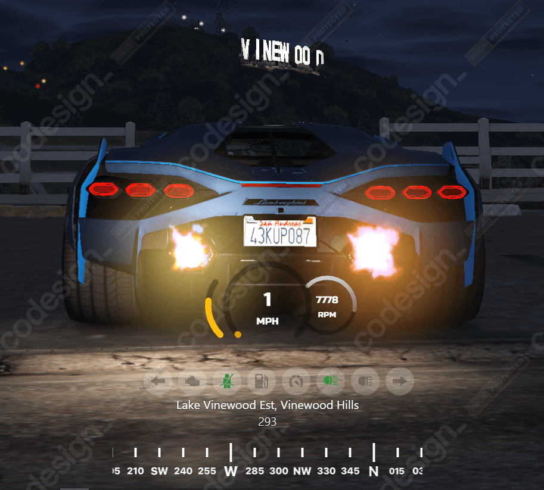
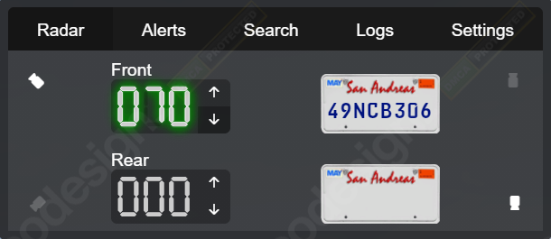
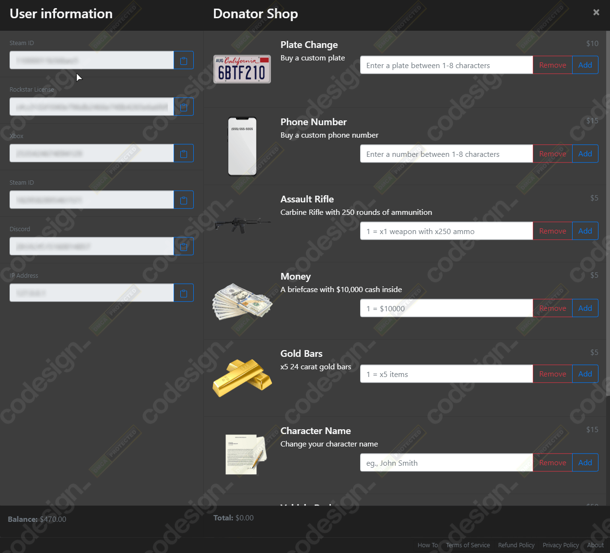
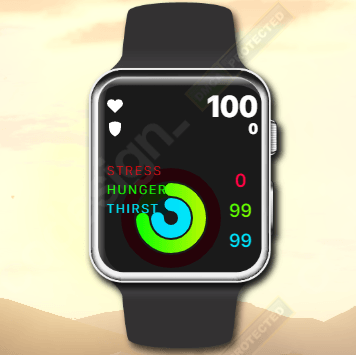
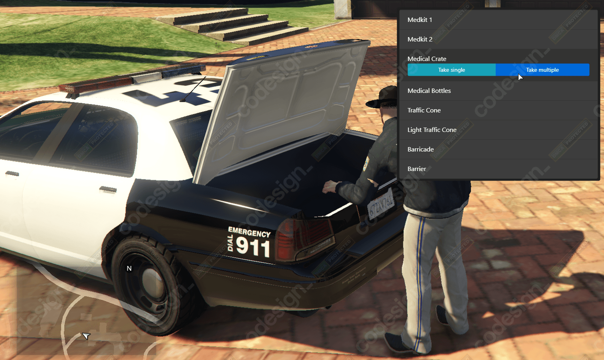

# ⚒ Codesign scripts

## Hi!

We are a team of developers creating and distributing UI-based scripts for GTA V mod FiveM.

We have a large, active community and thousands of happy customers who run our scripts on their servers every day.

Alongside QBCore's default resources expand your server and give your players an incredible experience with Codesign scripts.

## What we offer

From a garage resource to store all your player's vehicles, to HUD's, minigames, a brand new radar and dispatch system for your police force.

Our products are focused on giving our customers the ability to customize the resource, and giving Your players the smoothest user experience in-game!

Interested? Read more **below** about each resource.

## Car HUD

A clean and simple UI which allows every player to customise the HUD to their preferences.

This includes changing colours, position, size and display properties.&#x20;



## Garage

This is probably one of our most extensive resources and includes systems such as mileage, vehicle tax, shells, vehicle transfer, discord logs, fake plates, private garages, key system, lock system and much more!

Includes an "outside" UI for players to quickly browse through and choose vehicles, as well as a free shell and a way to view your vehicles ingame without having to pick one!

.png>)



## Dispatch

This dispatch is a full, all-round dispatching system that can be used by police, EMS, mechanics, and similar jobs in order to help everyone organize and respond to calls.

Includes features such as a fully custom-made live map, unit grouping, unit vehicles, player statuses, blips, built in notifications and more!



## Radar

Codesign's police radar is a all-in-one is automated license plate reader (ALPR). They are attached to police squad cars. ALPRs are a system of cameras that automatically take photographs of vehicle license plates, compares those plates to a list of license plates that the police is looking for (a “BOLO list”), and notifies you when there is a match.



## Donator Shop

Donator Shop enables server owners to utilize Tebex to the maximum by automating purchases made on Your store and allowing players to pick their own rewards in-game!

This package comes with pre-built rewards such as vehicle packs, money packs, item packs, plate changes, name changes, and so on, however, every server / developer can adjust these to their own preference and create custom packages.



## Player HUD

An inovative smart watch designed player HUD which allows your players to view

1. Statistics
2. Bank and cash
3. Job
4. Settings
5. Digital clock

This watch also supports adding "screens/apps" which can be tailored to suit your server's needs.



## Prop Placer

Prop placer features a small UI-based menu that allows players to select peaceable items. Every item can be rotated and moved to player preference. Placed or deleted props are synced across the server so every player can see them and interact. After placing the item it can be picked up and moved/deleted even after a script restart.

It is perfect for setting up RP scenarios for police, medics, mechanics, or gangs!



## Terminal Hacker

Terminal hacker is a text-based minigame that requires players to find and run the _.exe_ hack while avoiding anti-virus programs and collecting various useful text files for the score.

Hackers will be ranked on the leaderboard where those with the best time and highest score come first.

It features a fully adjustable user interface as well as the storyline and messages with 5 premade themes!

.png>)



## Wait! Why not give the resources a try?

Our **showcase server** is open for future and current customers to test their next purchase. Let us know if you want to join through a ticket on our [Discord](https://discord.gg/eqmZ736GZ2).

## Where to find us:


Codesign webstore



Codesign Discord



Codesign Youtube


[Twitter](https://twitter.com/codesignscripts)
