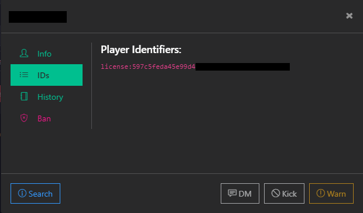

# 🔓 Setting Permissions

<details>

<summary>What are ace permissions?</summary>

Aces are the built-in permissions system provided by CFX. They allow for creating new nodes which have aces attached to them. This permission system consists of aces & principals. Essentially think of a tree with branches. We have our ace that we create and then each branch would be our principal which inherits the permissions of our ace

</details>


txAdmin should automatically set the server owner as the highest permission level


## Server Config

* At the bottom of your server.cfg file you will see a permissions section

```
## Permissions ##
add_ace group.admin command allow # allow all commands
{{addPrincipalsMaster}} # This is the way txAdmin assigns permissions to the server owner

# Resources
add_ace resource.qb-core command allow # Allow qb-core to execute commands

# Gods
add_ace qbcore.god command allow # Allow all commands

# Inheritance
add_principal qbcore.god group.admin # Allow gods access to the main admin group used to get all default permissions
add_principal qbcore.god qbcore.admin # Allow gods access to admin commands
add_principal qbcore.admin qbcore.mod # Allow admins access to mod commands 
```

### Different types of identifiers

* FiveM ID
* Rockstar license (what qbcore uses)
* Discord ID

To get a FiveM or GTA license you can look up the player on your txAdmin web panel



After gathering the desired identifiers, go to your server.cfg and add the `Players` section as shown below


qbcore.god and group.admin share the same permissions you can use either one.&#x20;


```
## Permissions ##
add_ace group.admin command allow # allow all commands
{{addPrincipalsMaster}} # This is the way txAdmin assigns permissions to the server owner

# Resources
add_ace resource.qb-core command allow # Allow qb-core to execute commands

# Gods
add_ace qbcore.god command allow # Allow all commands

# Inheritance
add_principal qbcore.god group.admin # Allow gods access to the main admin group used to get all default permissions
add_principal qbcore.god qbcore.admin # Allow gods access to admin commands
add_principal qbcore.admin qbcore.mod # Allow admins access to mod commands

# Players
add_principal identifier.license:xxxxxx qbcore.god # Player Name
add_principal identifier.license:xxxxxx qbcore.admin # Player Name
add_principal identifier.license:xxxxxx qbcore.mod # Player Name
```

## Setting users permissions in the server

While you have permissions you can set users permissions either using commands or the admin menu

<details>

<summary>Setting permissions using the command </summary>

* While in the server type in the command `/addpermission [id] [addpermissions]`

<!---->

* It will look something like this `/addpermission 1 god`

</details>

<details>

<summary>Setting permissions through the admin menu</summary>

* In chat enter the command `/admin`

<!---->

* Access the "Player Management" tab and select the player you want to give permissions to

<!---->

* Locate a menu item called "Permissions"

<!---->

* Set the user group for that user then press "submit"

</details>

## Allowing commands to specific permissions

In qb-core/config.lua find **`QBConfig.Server.Permissions = {'god', 'admin', 'mod'}`**


Here you can add more groups, lets say I wanted to make one for police I would have `QBConfig.Server.Permissions = {'god', 'admin', 'mod', 'leo'}`

Then in my server.cfg I would place this below admins like so `add_principal identifier.license:xxxxxxx qbcore.leo #players name`

Making a command for only leo can access would look like

```lua
QBCore.Commands.Add('spikes', 'Place spike strips', {}, false, function(source)
-- Run code
end, 'leo')
```

So now when you add this command using the qbcore function it will automatically generate an ace called qbcore.leo with an ace of command.spikes! Now you can add a principal of a player with `add_principal identifier.license:xxxx qbcore.leo` and now that command will be restricted to only those with that permission as well as remove the chat suggestion for anyone without this permission! Imagine if you used this when setting a players job or when a player clocked in/out to dynamically remove the permission. This also completely eliminates the need to ever check job permissions on a command like this because the command itself will already be restricted

