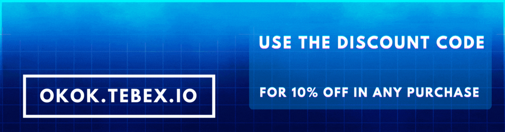
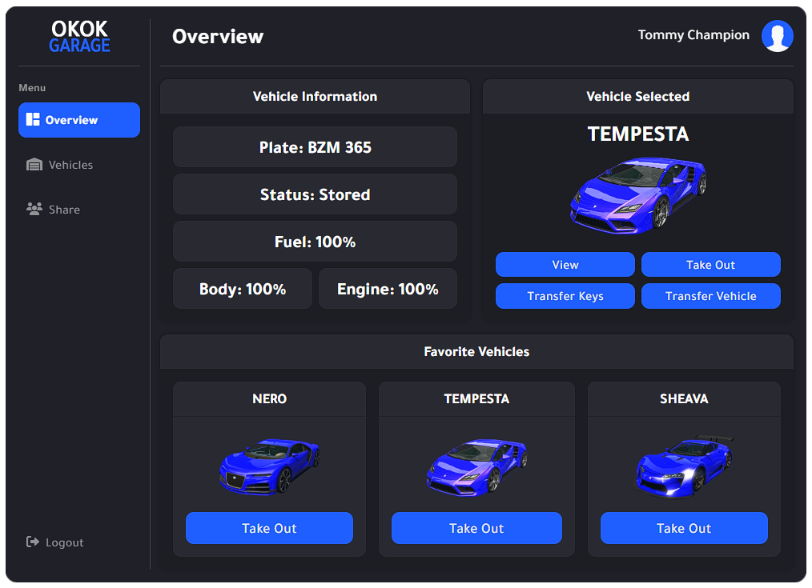
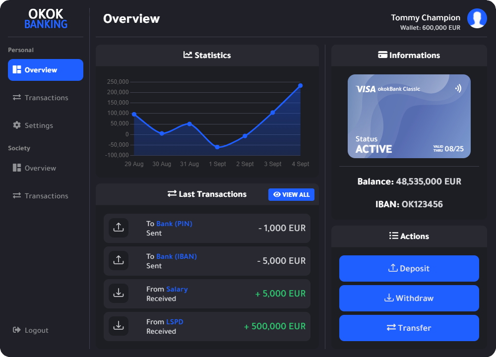
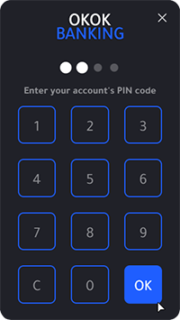
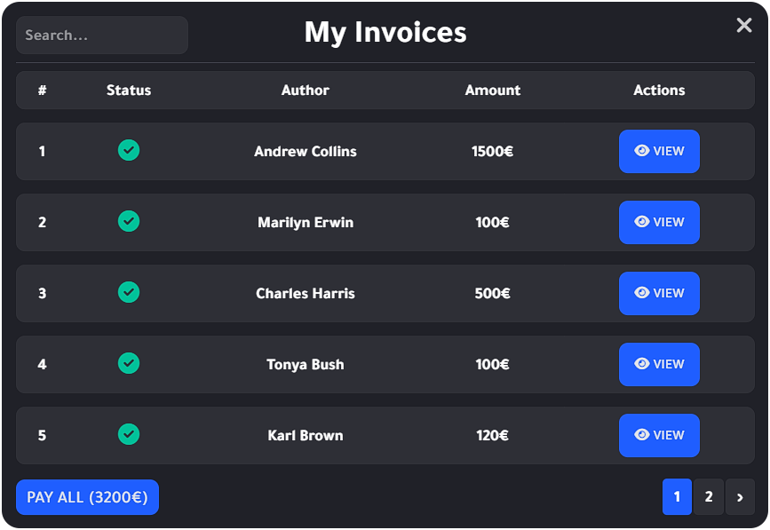
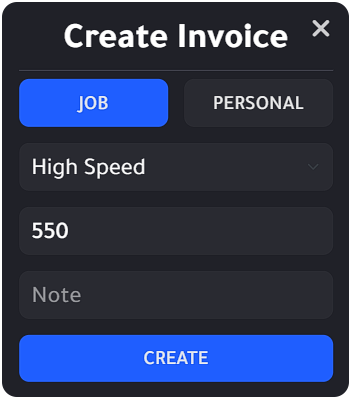
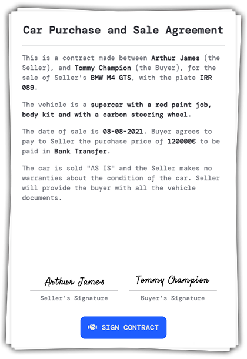

# 🆗 okok Scripts

## About Us

We are a duo team of developers who specialize in the creation and distribution of **affordable**, yet **high-end quality** FiveM resources.

With over 9000 members in our discord server and thousands of satisfied customers, our primary goal is listening to the feedback of our community, taking in their suggestions and creating scripts which will reach the vast majority audience within FiveM.

## Our Resources

We have a large selection of resources which are guaranteed to meet the needs of every FiveM Server. Offering a modernized aesthetic in our UI designs, which will impress players within your Server/Community as well as attract new members.

We also have a great support team which is prepared to assist you in the basics of installing the scripts within your server, help you fix any issues and answer any questions you may have, ensuring you're well taken care of.

## okokGarage

Our newest resource is an all-in-one Garage, Impound & Vehicle Keys system that offers a wide range of features for all your server needs. As well as, the aesthetically pleasing UI Design for both the Garage Menu & Viewing Mode. Some of the features include creating Public, Society or Private Garages by managing a garage business, setting your favorite vehicles, the ability to share access to your garage or a specific vehicle with your friends, give extra sets of keys, transfer vehicles and more. The "View" option includes many informative details and options related to your vehicle as well as the ability to repair.

<figure><figcaption>
View/Inspect Vehicle menu
</figcaption></figure>

<figure><figcaption>
Garage menu
</figcaption></figure>



## okokVehicleShop

Our Vehicle Shop offers a very modernized UI, allowing your players to browse a catalog of configured vehicle stock. Includes the choice of interactive missions to obtain the vehicles, and the options to be player owned or run independently, with as many shops as you like. It comes with many configurable options, allowing players the freedom to use the Vehicle Shop as they like. Being able to lock the shop to a job, or to a license as well as many more features.



## okokBanking

Our banking system allows you to choose if you would like to use the okokBanking integrated system which will create a bank account for your users as well as an additional shared account for your businesses. It also includes the option to use qb-management. This interactive banking system is highly enticing for your server and can be configured to your liking.



## okokBilling

Recently upgraded to V2, a full rework to our resource. It now features a beautiful dark theme with our original "okok" UI Design theme. A very simple billing/fining system, including Personal/Society invoices for all your personal or business needs. Conveninece options such as Pay All Invoices, Pay References, Inspect Player, VAT System, Autopay and more.

<figure><figcaption>
Selection menu
</figcaption></figure>

<figure><figcaption>
Personal Invoices menu
</figcaption></figure>

<figure><figcaption>
Create Invoice menu
</figcaption></figure>



## okokContract

Our contract resource is a must for any FiveM Server. Allowing players the ability to sell/trade player owned vehicles between each other with simplicity and interactivity. An item requirement of a "contract" will give your players a fun interaction with a great UI which includes the use of signature as well as the transfer of vehicles between the players with ease.



## okokChat

This chat theme stands out from the others because it includes a very clean design and an export to convert other commands/systems to use its structure with simplicity. It comes with many configurable options, allowing your players to use diversified chat commands, which allows them to communicate in confidence with each other.

.png>)



## okokCrafting

This crafting system is extremely advanced in comparison to its competitors. With the ability to set up as many crafting tables of your choice, this also includes many configurable options such as: setting up a level requirement/XP system, success/failure percentage, job/gang restriction, comes with a beautiful UI and a queue system.



## okokReports

An extremely advanced reports system allowing your players to choose between 3 categories when sending in their inquiry (Bug Report, Question or Reporting a player). Once a report is received, online staff will be notified and able to "accept" who takes the incoming report, as well as additional options such as teleporting to the player, bringing them, concluding the report. Not to mention a beautiful chat system between player and the staff who accepted the report so communication can go as smoothly as possible.



## okokMarketplace

Comes standard with an Item Marketplace, a Vehicle Marketplace and a Black Marketplace (which can be configured to be removed if needed). Allows players to set up ads with their items/vehicles at a set price, which gives others the option to purchase. The Black Market is great for the criminal underworld, allowing you the option to blacklist items from being sold or jobs from being able to access it, giving your players the chance to trade in confidence.



## okokTalkToNPC

One of the most interactive systems. You have full freedom to do as you please with this script. You can set up as many NPCs wherever you like, being able to choose their animation/pose as well as configure all their clickable options. Contains the ability to tie it to certain actions or trigger events, the possibilities are endless and extremely fun for your players to experience.


