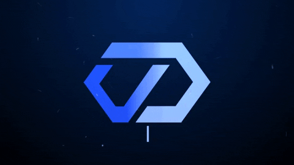
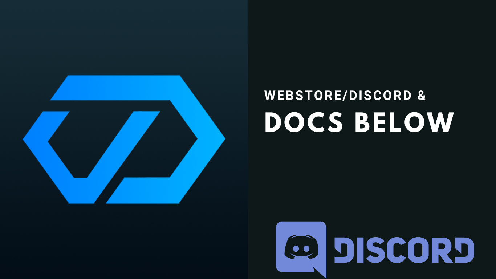

# 🤖 cDev

## Why cDev?

We have the in house experience in running community's, we understand running a community may be challenging at given times. Our primary focus has been creating the true multi purpose bot based off your suggestions, your feedback and our experience, because of that we've delivered a product that can keep your Discord safe and deliver the tools to manage your community.

* An example to the active protection is our Anti Discord Phishing, no more "free nitro links" in your channels, we block over 13.000 phishing links automatically for you.

**Customization as a default**

* **Avatar:** You can create a custom avatar for your bot and update it any time. (You own the application)
* **Bot Name:** You can set any bot name you'd like.
* **Activity Status:** Supports all type's of activity status', including streaming!&#x20;
* **Bot Bio:** You can set a custom bio for the bot/application.

**Community Features**

* **Giveaways:** Host giveaways with your cDev bot!
* **Tickets:** Multi panel ticketing system!
* **Moderation:** We make sure your Discord mods can keep your community safe!
* **Auto Roles/Reaction Roles:** Create on the go and update whenever you want.
* **Twitch Streamers**: Our bot ♥ Twitch Streamers
* **Suggestions**: Must have for each community!
* **Music:** Listen to music with your friends!
* **FiveM (Server Status):** Display your server name & playercount with a click to join button!

**cDev Reviews**

* **Kings#4220**:  _The bot I purchased @NovaKing is one of the most features rich bots I've had on a server up acts as a "all-in-one" bot so no more having 12 different bots doing each one small thing some of the features come in handy like the sticky message feature and the suggestions feature would definitely recommend buying this bot for any growing/big community_
* **Carmomeister#7655**: _The crew here at cDev equipped us with our bot (CQC) for our FiveM Development Community. We've experienced excellent assistance from the cDev team, especially @onesource , and the capabilities included with the bot are incredibly useful. We've loved it so much that we've decided to get a second one for our FiveM Server. We recommend purchasing this bot for your server, whether it's an RP server or a Community server. This is the "All-In-One" bot you will undoubtedly fall in love with._


**cDev Webstore**



**cDev Documentation**



**cDev Discord**

