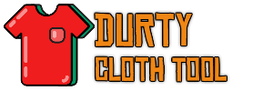
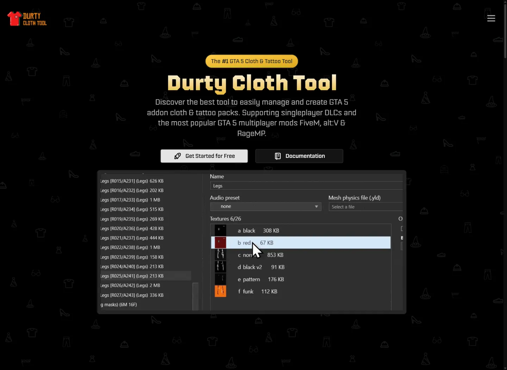

# 👕 Durty Cloth Tool

<figure></figure>

Custom clothing can add a lot to a QBCore server, but turning loose models and textures into a working addon pack takes careful setup. Durty Cloth Tool keeps clothing and tattoo production in one desktop workflow, with no previous GTA V modding knowledge required to get started.

## From source files to a usable pack

* Create and manage addon clothing and tattoo projects
* Preview work in 3D before testing it in game
* Run validation and quality reports before release
* Optimize textures and keep pack sizes under control
* Export projects for FiveM and other supported GTA V platforms

## Useful across the server team

Clothing creators can iterate on packs without rebuilding everything by hand. Developers can catch asset and project issues earlier. Server owners get a clearer workflow for preparing branded clothing, job uniforms, gang outfits, and other custom wearables for their community.

<figure></figure>

## Download and try it

Download the Windows app and test the core workflow on a smaller project. No license is required while testing, but the free project-size limits still apply.

<a href="https://github.com/DurtyFree/durty-cloth-tool/releases/latest/download/DurtyClothTool.App.zip" class="button primary">Download Durty Cloth Tool</a>

Want to compare the available plans first? [Visit the Durty Cloth Tool website](https://gta.clothing/). When you are ready to build, [follow the first-project quickstart](https://docs.gta.clothing/getting-started/quickstart).


