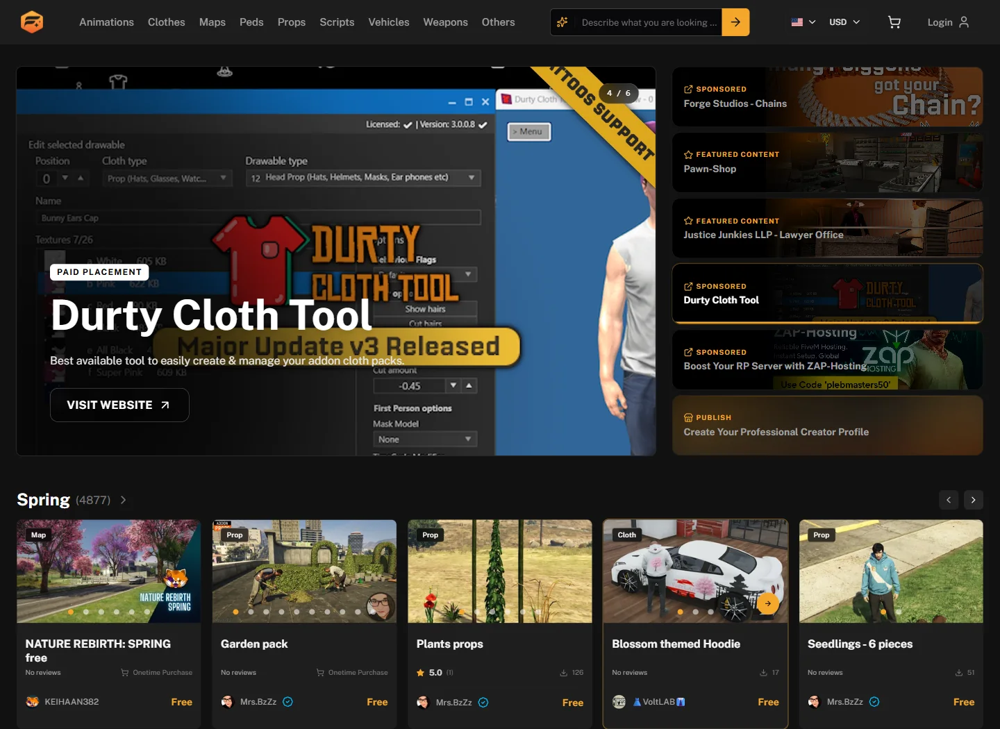

# ✨ Forge Mods

<figure></figure>

Finding the right content for a QBCore server should not mean losing track of releases across dozens of places. Forge Mods brings free and paid GTA V content into one moderated platform where server owners can browse and creators can publish.

## Browse with a purpose

* Explore scripts, maps, MLOs, vehicles, clothing, weapons, props, and peds
* Filter releases by content type instead of scrolling through unrelated listings
* Browse MLOs from the map when location matters
* Check creator profiles and find more releases from the same creator

Always check a release's requirements and framework compatibility before adding it to a live QBCore server.

## A place for creators too

FiveM developers, map makers, clothing artists, and other GTA V creators can publish their work where server owners are already looking for new content. A creator profile also gives people one place to find your releases.

<figure></figure>

## Browse or publish

Use Forge Mods to find your next server addition or put your own release in front of the community.

<a href="https://forgemods.de/browser" class="button primary">Browse Forge Mods</a>

Publishing your own work? [Create a release on Forge Mods](https://forgemods.de/publish).


