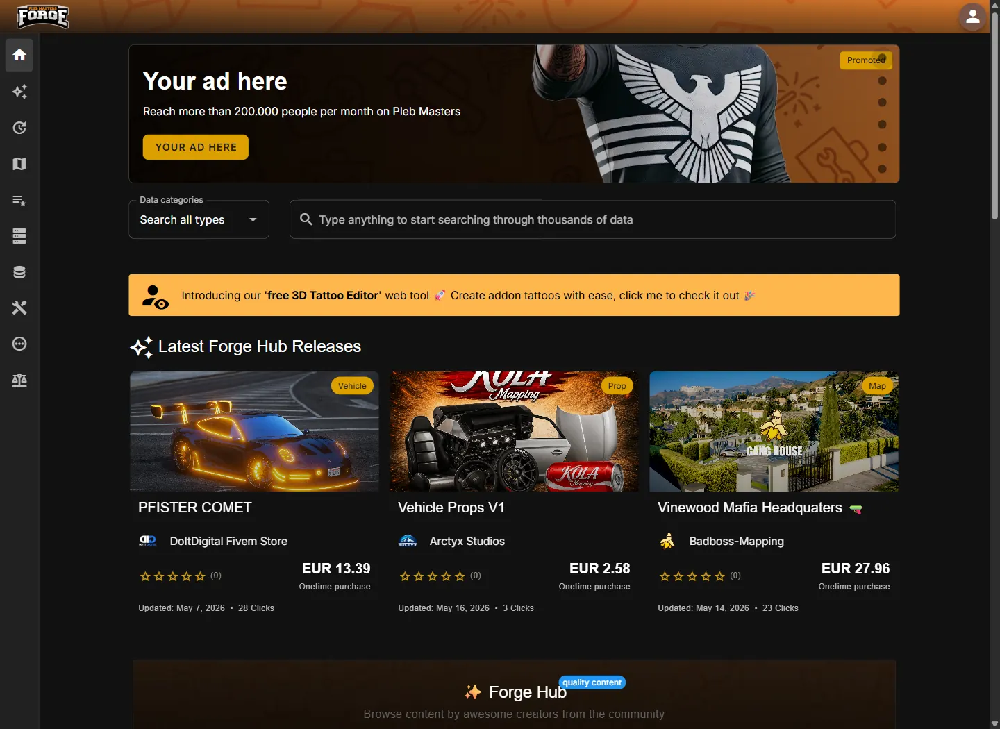

# 🔎 Pleb Masters: Forge

<figure></figure>

Building or configuring a QBCore resource often starts with a simple question: which model, hash, animation, or map data do I need? Pleb Masters: Forge puts years of GTA V research in one searchable workbench, so you can spend less time digging through game files and more time working on your server.

## What you can find

* Objects and props with visual previews
* Vehicles, peds, weapons, clothing, and tattoos
* Maps, MLOs, animations, and hashes

## Built for everyday QBCore work

Server owners can look up assets while configuring jobs, housing, interiors, vehicles, or clothing. Developers can confirm model names and hashes while writing or debugging resources. Map and content creators can inspect game data before committing it to a release.

<figure></figure>

## Search Forge

Forge is free to use and opens directly in your browser.

<a href="https://forge.plebmasters.de/" class="button primary">Search GTA V data</a>


