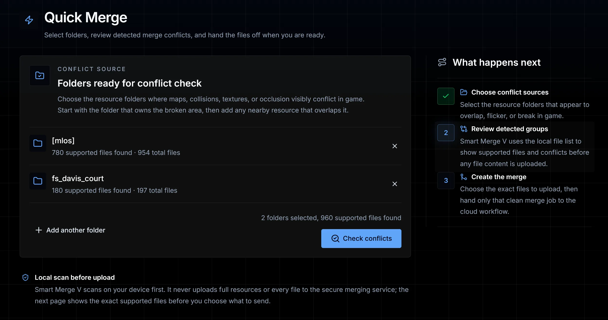

# 🧩 Smart Merge V

<figure>
  <picture>
    <source srcset="../.gitbook/assets/smart-merge-v-logo-dark.png" media="(prefers-color-scheme: dark)">
    
  </picture>
</figure>

Two map resources can work perfectly on their own and still break the same area when they run together. Smart Merge V helps QBCore server owners, developers, and map creators find that overlap, review the affected files, and prepare a merged resource for supported conflicts without editing every file by hand.

## Built for the conflicts you can see in game

* Flickering or duplicated props
* Invisible walls and broken collision
* Occlusion clashes and bad map visibility
* LOD problems caused by overlapping resources

## A guided merge workflow

Choose the resource folders that appear to conflict and let Smart Merge V scan them locally first. It groups supported conflicts for review, shows what is involved before you upload anything, and creates a guided merge with the installation steps you need.

This is especially useful on established QBCore servers where several map packs touch the same part of the world.

<figure></figure>

## Check map compatibility

The free compatibility checker compares filenames and relative paths to show where map resources may overlap before installation. It is a private precheck, not the full file-content analysis used by the merge workflow.

<a href="https://smartmerge.de/compatibility-checker" class="button primary">Run a compatibility check</a>

Need file-content analysis and a guided merge? [Open Smart Merge V in your browser](https://app.smartmerge.de/).


