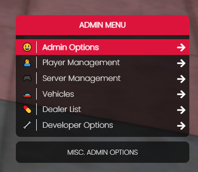

# 🔧 qb-adminmenu

## Introduction

* The admin menu offers a wide range of capabilities and utilizes the popular menu resource menuV as a dependency. The base permission level for opening it is admin but can also be accessed with a god level permission as well. The menu is easily expandible and allows for as many options as the user desires

## Preview

## Commands

/admin <strong>-</strong> opens the admin menu

Opens the admin menu

**Permission level:** admin

/blips - toggles player blips

Adds a blip to the map for all players. Useful to monitor player locations.

**Permission level:** admin

/names - toggles player names

Shows player names and IDs above heads

**Permission level:** admin

/coords - shows your current coords

Shows your current coordinates in `vector3(x, y, z)` format

**Permission level:** admin

/maxmods - sets vehicle to max mods

Sets the current vehicle to have maximum performance modifications

**Permission level:** admin

/noclip - toggles noclip

Toggles noclip

**Permission level:** admin

/admincar - adds current vehicle to garage

Saves the current vehicle to the database table `player_vehicles` allowing access to the vehicle in the garage

**Permission level:** admin

/announce [message] - creates an announcement

Creates an announcement to be sent to all players in the chat.&#x20;

**Permission level:** admin

* **message** - (required) The message to send

/report [message] - create a report to staff

Sends a message to staff in the chat and stores the message as a report

**Permission level:** user

* **message** - (required) The message to send

/reportr [message] - replies to a user report

Replies to a user report with the given `message`

**Permission level:** admin

* **message** - (required) The message to send in the reply

/reporttoggle - opt in/out of receiving player reports

Opt in/out of receiving player reports in chat

**Permission level:** admin

/staffchat [message] - sends a staff-only message

Sends a message in chat visible only to users with the 'admin' permission level

**Permission level:** admin

* **message** - (required) The message to send

/warn [id] [reason] - warn a player

Sends a message to the player with the given `id` with the `reason` given. Also, adds a warning against the player in the database table `player_warns`

**Permission level:** admin

* **id** - (required) The id of the player being warned
* **reason** - (required) The reason for giving a warning

/checkwarns [id] [opt: number] - view a warning for a given player

Checks for existing warnings against a player with the given `id`. If no warning number is given in the command, it will display the number of warnings the player has received. If a warning number is given in the command, it will display that warning.

**Permission level:** admin

* **id** - (required) The id of the player being checked
* **number** - (optional) The warning number (1, 2, 3, etc...)

/delwarn [id] [number] - deletes a warning from a player

Deletes a warning from a player and removes the database entry

**Permission level:** admin

* **id** - (required) The id of the player
* **number** - (required) The warning number to be deleted (1, 2, 3 etc...)

/givenuifocus [id] [hasFocus] [hasCursor] - Sets nuifocus state for player

This command sets the NUI focus state for a player with the given `id`. This allows you to manually set the following native: [https://docs.fivem.net/natives/?\_0x5B98AE30](https://docs.fivem.net/natives/?\_0x5B98AE30)\
Useful if a player is stuck in an NUI overlay.

**Permission level:** admin

* **id** - (required) The id of the player
* **hasFocus** - (required) \[true/false] Whether the NUI has focus or not
* **hasCursor** - (required) \[true/false] Whether the player has cursor when using NUI

/setmodel [model] [id] - changes the players ped model

Changes the ped `model` of the player with the given `id`.

**Permission level:** admin

* **model** - (required) The ped model to change to
* **id** - (required) The id of the player whos ped model is being changed

/setspeed [opt: speed] - sets players foot speed

Sets your foot speed between default and "fast"

**Permission level:** admin

* **speed** - (optional) \["fast"] will set foot speed to "fast". If this argument is left blank it will set foot speed to "normal"

/kickall - kick all players from server

Kicks all players from the server.

**Permission level:** god

/setammo [amount] [opt: weapon] - set weapon ammo

Sets the ammo amount for current gun in hand or `weapon` if given

**Permission level:** admin

* **amount** - (required) The amount of ammo to set
* **weapon** - (optional) The weapon to set the ammo for. Will set ammo for current gun in hand if left blank

/vector2 - Copies vector2 to clipboard

Copies `vector2(x, y)` to clipboard of your current coordinates.

**Permission level:** admin

/vector3 - Copies vector3 to clipboard

Copies `vector3(x, y, z)` to clipboard of your current coordinates

**Permission level:** admin

/vector4 - Copies vector4 to clipboard

Copies `vector4(x, y, z, w)` to clipboard of your current coordinates

**Permission level:** admin

/heading - Copies heading

Copies heading `w` to clipboard of your current heading (the direction you are facing)

**Permission level:** admin

