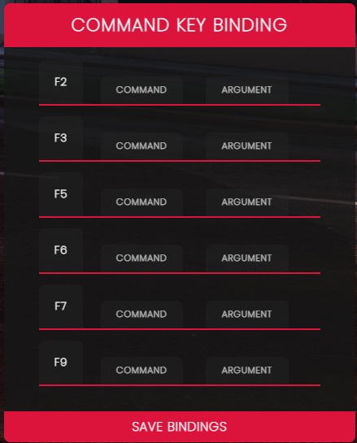

# 🔄 qb-commandbinding

## Introduction

* Allows users to bind keys to the keys F2-F9 can also be changed in the "Fivem" section of GTAV "keybinds" menu


Using the menu is as easy as putting the command name in the COMMAND field and the argument in the ARGUMENT field. If you don't fill out an argument then the command will just run as intended without any additional information sent to it.&#x20;


Example: Add the word "fix" into the command field and leave the argument blank. This command repairs your vehicle and does not take any arguments\
\
Example: Add the word "revive" into the command field. If you leave the argument field blank then it will revive you but you could also add a number for a players id which will revive them instead


## Preview



## Configuration

#### Adding available keys to bind (found in client/main.lua)


Currently must add additional keys to the html and JavaScript files


```lua
local availableKeys = { -- https://docs.fivem.net/docs/game-references/controls/
    {289, "F2"}, -- Corresponding control and label
    {170, "F3"},
    {166, "F5"},
    {167, "F6"},
    {168, "F7"},
    {56,  "F9"},
    {57, "F10"},
}
```
