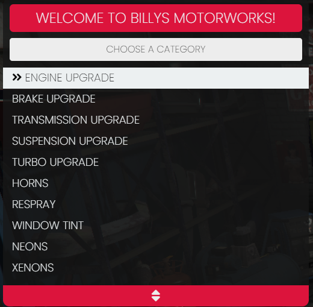

# 🎨 qb-customs

## Introduction

* Handles all vehicle customization and can be locked to a job or open to all players

## Preview



## Configuration

### General

```lua
Config = {}
Config.Debug = true/false -- Set to True to enable Debug Prints
Config.MoneyType = 'bank' -- Type of money deducted for upgrades
Config.RepairMoneyType = 'cash' -- Type of money deducted for repairs
Config.UseRadial = true/false -- Use qb-radial menu for entering instead of press E
Config.allowGovPlateIndex = true/false -- Setting this to true will allow all vehicles to purchase gov plate index "Blue on White #3" (only for emergency vehicles otherwise)
maxVehiclePerformanceUpgrades = 0 -- | All Upgrades: 0 | No Upgrades: -1 | Can be -1 to 4
```

### Locations

* Found in shared/locations.lua

```lua
Config.Locations = {
    ['mycoolshop'] = { -- unique shop name
        settings = {
            label = 'My Cool Shop',
            welcomeLabel = "Welcome to My Cool Shop!", -- Shows at top of menu
            enabled = true/false -- Enable/disable this shop
        },
        blip = { -- Define blip data
            label = 'Bennys Motorworks',
            coords = vector3(-205.6992, -1312.7377, 31.1588),
            sprite = 72,
            scale = 0.65,
            color = 0,
            display = 4,
            enabled = true,
        },
        categories = { -- Available categories at this shop
            mods = true,
            turbo = true,
            repair = true,
            respray = true,
            liveries = true,
            wheels = true,
            tint = true,
            plate = true,
            extras = true,
            neons = true,
            xenons = true,
            horn = true,
            cosmetics = true,
        },
        drawtextui = { -- Displays when going into shop zone
            text = "Bennys Motorworks"
        },
        restrictions = { 
            job = { 'bennys', 'mechanic'}, -- Whitelist Jobs (optional)
            allowedClasses = { 18 }, -- Whitelist vehicle classes (optional)
            deniedClasses = { 18 } -- Restrict vehicle classes (optional)
        },
        zones = { -- Data for box zones to enter shop
            {
                coords = vector3(-212.55, -1320.56, 31.0),
                length = 6.0,
                width = 4.0,
                heading = 270.0,
                minZ = 29.88,
                maxZ = 33.48
            },
            {
                coords = vector3(-222.47, -1329.73, 31.0),
                length = 6.0,
                width = 4.0,
                heading = 270.0,
                minZ = 29.88,
                maxZ = 33.48
            },
        }
    },
}
```

### Vehicle Upgrade Pricing

```lua
vehicleCustomisationPrices = {
    cosmetics = {price = 400},
    respray = {price = 1000},
    performance = {prices = {0, 3250, 5500, 10450, 15250, 20500, 25000}},
    turbo = {prices = {0, 15000}},
    wheels = {price = 400},
    customwheels = {price = 600},
    wheelsmoke = {price = 400},
    windowtint = {price = 400},
    neonside = {price = 100},
    neoncolours = {price = 500},
    headlights = {price = 100},
    xenoncolours = {price = 500},
    oldlivery = {price = 500},
    plateindex = {price = 1000}
}

vehicleCustomisation = {} -- Found lower in config, lists all categories
```

### Vehicle Respray Categories

```lua
vehicleResprayCategories = {
    {category = "Primary Colour", id = 0},
    {category = "Secondary Colour", id = 1},
    {category = "Pearlescent Colour", id = 2},
    {category = "Wheel Colour", id = 3},
    {category = "Dashboard Colour", id = 4},
    {category = "Interior Colour", id = 5}
}

vehicleResprayOptions = {} -- Found lower in config, lists all categories/colors
```

### Vehicle Window Tints

```lua
vehicleWindowTintOptions = {
    {name = "None", id = 0},
    {name = "Pure Black", id = 1},
    {name = "Darksmoke", id = 2},
    {name = "Lightsmoke", id = 3}
}
```

### Vehicle Headlights

```lua
vehicleXenonOptions = {
    xenonColours = {
        {name = "Stock", id = 255},
        {name = "White", id = 0}, {name = "Blue",id = 1},
        {name = "Electric Blue", id = 2},
        {name = "Mint Green", id = 3},
        {name = "Lime Green", id = 4},
        {name = "Yellow", id = 5},
        {name = "Golden Shower", id = 6},
        {name = "Orange", id = 7},
        {name = "Red", id = 8},
        {name = "Pony Pink", id = 9},
        {name = "Hot Pink", id = 10},
        {name = "Purple", id = 11},
        {name = "Blacklight", id = 12}
    }
}
```

### Vehicle Wheels

```lua
vehicleWheelOptions = {
    {category = "Custom Tyres", id = -1, wheelID = 23},
    {category = "Tyre Smoke", id = 20, wheelID = 23},
    {category = "Sport", id = 0, wheelID = 23},
    {category = "Muscle", id = 1, wheelID = 23},
    {category = "Lowrider", id = 2, wheelID = 23},
    {category = "SUV", id = 3, wheelID = 23},
    {category = "Offroad", id = 4, wheelID = 23},
    {category = "Tuner", id = 5, wheelID = 23},
    {category = "Motorcycle", id = 6, wheelID = 23},
    {category = "Highend", id = 7, wheelID = 23},
    {category = "BennysWheel", id = 8, wheelID = 23},
    {category = "BespokeWheel", id = 9, wheelID = 23},
    {category = "Dragster", id = 10, wheelID = 23},
    {category = "Street", id = 11, wheelID = 23},
    {category = "Rally", id = 12, wheelID = 23},
}
```

### Vehicle Tire Smoke

```lua
vehicleTyreSmokeOptions = {
    { name = "White Smoke", r = 254, g = 254, b = 254},
    { name = "Black Smoke", r = 1, g = 1, b = 1},
    { name = "Blue Smoke", r = 0, g = 150, b = 255},
    { name = "Yellow Smoke", r = 255, g = 255, b = 50},
    { name = "Orange Smoke", r = 255, g = 153, b = 51},
    { name = "Red Smoke", r = 255, g = 10, b = 10},
    { name = "Green Smoke", r = 10, g = 255, b = 10},
    { name = "Purple Smoke", r = 153, g = 10, b = 153},
    { name = "Pink Smoke", r = 255, g = 102, b = 178},
    { name = "Gray Smoke", r = 128, g = 128, b = 128}
}
```

### Vehicle Neons

```lua
vehicleNeonOptions = {
    category = "Neons",
    neonTypes = {
        {name = "Front Neon", id = 2},
        {name = "Rear Neon", id = 3},
        {name = "Left Neon", id = 0},
        {name = "Right Neon", id = 1}
    },
    neonColours = {
        { name = "White", r = 222, g = 222, b = 255},
        { name = "Blue", r = 2, g = 21, b = 255},
        { name = "Electric Blue", r = 3, g = 83, b = 255},
        { name = "Mint Green", r = 0, g = 255, b = 140},
        { name = "Lime Green", r = 94, g = 255, b = 1},
        { name = "Yellow", r = 255, g = 255, b = 0},
        { name = "Golden Shower", r = 255, g = 150, b = 0},
        { name = "Orange", r = 255, g = 62, b = 0},
        { name = "Red", r = 255, g = 1, b = 1},
        { name = "Pony Pink", r = 255, g = 50, b = 100},
        { name = "Hot Pink", r = 255, g = 5, b = 190},
        { name = "Purple", r = 35, g = 1, b = 255},
        { name = "Blacklight", r = 15, g = 3, b = 255}
    }
}
```
