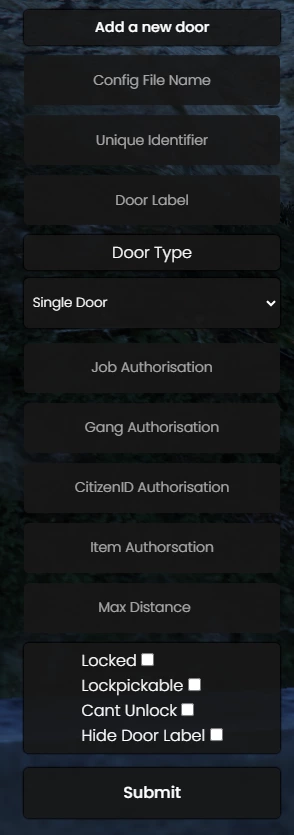

# 🚪 qb-doorlock

## Introduction

* This doorlock system is based on [nui\_doorlock by thelindat](https://github.com/thelindat/nui\_doorlock) and contains compatibility with its format

## Preview



## Configuration


DO NOT CHANGE THE DEFAULT BANK DOORS IN THE CONFIG IF USING QB-BANKROBBERY



The door id is the index of the door config table


### General

```lua
Config = {}
Config.CommandPermission = 'god' -- permission level for creating new doors
Config.AdminAccess = false -- Enable admins to unlock any door
Config.AdminPermission = 'god' -- The permission needed to get AdminAccess if it is enabled
Config.Warnings = false -- if true it will show warnings in the console when certain requirements aren't met
Config.FallbackDistance = 3.0 -- Distance to fall back on when it is not set
Config.EnableSounds = true -- Enable sounds when unlocking/locking doors (doors triggered by scripts can have the sound manually disabled)
Config.EnableAnimation = true -- Enable the animation when unlocking/locking doors (doors triggered by scripts can have the animation manually disabled)
Config.SaveDoorDialog = true -- Saves the door dialogue popup between door saves
Config.PersistentDoorStates = false -- Persists the door state between server restarts
Config.PersistentSaveInternal = 60000 -- How often door states are saved to the file system, in miliseconds.
```

### Door Labels/Colors

```lua
Config.ChangeColor = false -- Change the color of the box of the popup text based on if it is locked or not
Config.DefaultColor = 'rgb(19, 28, 74)' -- The default color of the box of the popup text if Config.ChangeColor is false
Config.LockedColor = 'rgb(219 58 58)' -- The color of the box of the popup text if Config.ChangeColor is true and the door is locked
Config.UnlockedColor = 'rgb(27 195 63)' -- The color of the box of the popup text if Config.ChangeColor is true and the door is unlocked
Config.UseDoorLabelText = false -- Will use the LABEL field as the nui text instead of locked/unlocked
Config.DoorDebug = false -- Enable DRAWTEXT in the world at the coords where the door 'center' is
Config.RemoteTriggerDistance = 15.0 -- This is how far from your camera the raycast will go to try to hit something solid
Config.RemoteTriggerMinDistance = 5.0 -- This is the minimum distance required for the raycast hit to count near a door. It will take the larger two between this and 'distance' option
```

### Item Removal

```lua
Config.Consumables = { -- The items will get removed once used on a door that has the item on it
    ['ticket'] = 1, -- item name and amount
    ['paperclip'] = 1
}
```

### Single Door Configuration

```etlua
  ['somesingledoor'] = { -- The index of the table, this is used as the doorID
        objName = 'hei_v_ilev_bk_gate2_pris', -- Door object name can be a string or a number. Alias: objHash = 'hei_v_ilev_bk_gate2_pris',
        objCoords  = vec3(261.83, 221.39, 106.41), -- Object coords
        textCoords = vec3(261.83, 221.39, 106.41), -- Coords for the interaction text
        authorizedJobs = { ['police'] = 0 }, -- Job access (checks for a minimum grade of 0)
        authorizedGangs = { ['vagos'] = 0 }, -- Gang access (checks for a minimum grade of 0)
        authorizedCitizenIDs = { ['BUI05180'] = true }, -- Citizen ID access
        items = { ['keycard'] = 1, ['banana'] = 3 }, -- Item access, can be a string or table | the value of the item is the amount of items needed when using a table, if it is a string it will always check if this person has one or more of the item
        needsAllItems = false, -- true or false | Whether to check if the person has all items to unlock the door or just one of the items
        allAuthorized = false, -- true or false | Will give access to everyone if it is true
        objYaw = -110.0, -- Heading of the door. Alias: objHeading = -110.0,
        locked = true, -- true or false | Is the door locked by default
        pickable = false, -- true or false | Can the door be lockpicked. Alias: lockpick = false,
        distance = 1.5, -- At what range the interaction text will show. Alis: maxDistance = 1.5,
        doorType = 'door', -- The type of door, can be door, double, sliding, doublesliding or garage
        fixText = true, -- true or false | fix the text to the center of the door
        doorLabel = 'Cloakroom', -- Label of the door that shows up when nearby
        audioRemote = true, -- true or false | Play sound from the player instead of the door
        audioLock = {['file'] = 'metal-locker.ogg', ['volume'] = 0.6}, -- Play sound on door lock
        audioUnlock = {['file'] = 'metallic-creak.ogg', ['volume'] = 0.7}, -- Play sound on door unlock
        autoLock = 1000, -- Auto lock after this many miliseconds
        doorRate = 1.0,  -- The rate of the animation to lock/unlock the door
        cantUnlock = true -- true or false | Set to true to not allow the player to unlock the door, only lock it. This means a script will have to trigger the unlock
        hideLabel = true, -- Set to true to hide the popup label, for hiding doors
        remoteTrigger = true, -- true or false | If you want to be able to remote trigger a door with H, put this here
  },
```

### Double Door Configuration

```etlua
  ['somedoubledoor'] = { -- The index of the table, this is used as the doorID, can be a number or a string
        doors = { -- Table of doors which holds both doors' data
		{
			objName = 'v_ilev_rc_door2', -- Door object name can be a string or a number. Alias: objHash = 'v_ilev_rc_door2',
			objYaw = 135.0, -- Heading of the door. Alias: objHeading = 135.0,
			objCoords = vec3(-447.7283, 6006.702, 31.86523), -- Object coords
		},

		{
			objName = 'v_ilev_rc_door2', -- Door object name can be a string or a number. Alias: objHash = 'v_ilev_rc_door2',
			objYaw = -45.0,  -- Heading of the door. Alias: objHeading = -45.0,
			objCoords = vec3(-449.5656, 6008.538, 31.86523), -- Object coords
		},
	},
        textCoords = vec3(-448.67, 6007.52, 31.86523), -- Coords for the interaction text
        authorizedJobs = { ['police'] = 0 }, -- Job access (checks for a minimum grade of 0)
        authorizedGangs = { ['vagos'] = 0 }, -- Gang access (checks for a minimum grade of 0)
        authorizedCitizenIDs = { ['BUI05180'] = true }, -- Citizen ID access
        items = { ['keycard'] = 1, ['banana'] = 3 }, -- Item access, can be a string or table | the value of the item is the amount of items needed when using a table, if it is a string it will always check if this person has one or more of the item
        needsAllItems = false, -- true or false | Whether to check if the person has all items to unlock the door or just one of the items
        allAuthorized = false, -- true or false | Will give access to everyone if it is true
        locked = true, -- true or false | Is the door locked by default
        pickable = false, -- true or false | Can the door be lockpicked. Alias: lockpick = false,
        distance = 2.5, -- At what range the interaction text will show. Alis: maxDistance = 2.5,
        doorType = 'double', -- The type of door, can be door, double, sliding, doublesliding or garage
                    fixText = true, -- true or false | fix the text to the center of the door
        doorLabel = 'Cloakroom', -- Label of the door that shows up when nearby
        audioRemote = true, -- true or false | Play sound from the player instead of the door
        audioLock = {['file'] = 'metal-locker.ogg', ['volume'] = 0.6}, -- Play sound on door lock
        audioUnlock = {['file'] = 'metallic-creak.ogg', ['volume'] = 0.7}, -- Play sound on door unlock
        autoLock = 1000, -- Auto lock after this many miliseconds
        doorRate = 1.0,  -- The rate of the animation to lock/unlock the door
        cantUnlock = true -- true or false | Set to true to not allow the player to unlock the door, only lock it. This means a script will have to trigger the unlock
        hideLabel = true, -- Set to true to hide the popup label, for hiding doors
        remoteTrigger = true, -- true or false | If you want to be able to remote trigger a door with H, put this here
  },
```

## Commands

* /newdoor - opens UI for creating new door (configure permission level in config)
* /doordebug - debug for doorlocks
