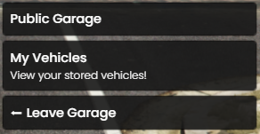
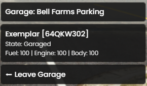

# 🚘 qb-garages

## Introduction

* Handles the storing of vehicles for public and house garages. Supports land, air and sea vehicles as well as jobs and gangs. Also includes an impound system!

## Preview






## Configuration

```lua
AutoRespawn = false --True == auto respawn cars that are outside into your garage on script restart, false == does not put them into your garage and players have to go to the impound
SharedGarages = false   --True == Gang and job garages are shared, false == Gang and Job garages are personal
VisuallyDamageCars = true --True == Visually damage cars that go out of the garage depending of body damage, false == Do not visually damage cars (damage is still applied to car values)

Garages = {
    ["motelgarage"] = { -- Name of the garage
        label = "Motel Parking", -- Label of the garage
        takeVehicle = vector3(273.43, -343.99, 44.91), -- vehicle withdraw point
        spawnPoint = vector4(270.94, -342.96, 43.97, 161.5), -- vehicle spawn point
        putVehicle = vector3(276.69, -339.85, 44.91), -- vehicle store point
        showBlip = true, -- enable/disable the blip on the map
        blipName = "Public Parking", -- name of blip
        blipNumber = 357, -- https://docs.fivem.net/docs/game-references/blips/
        type = 'public', -- public, job, gang, depot
        vehicle = 'car' -- car, air, sea
    },
}
```
