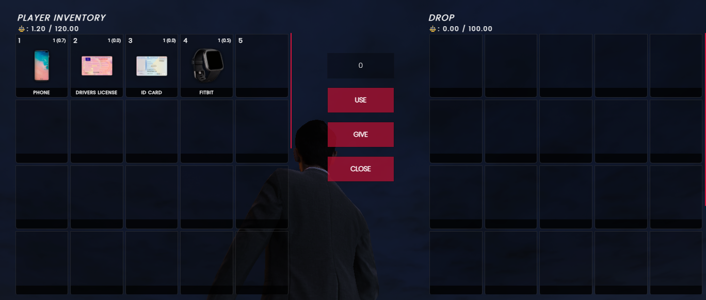

# 🎒 qb-inventory

## Introduction

* Handles all the player's storage such as personal, vehicle, stash, drops
* Built-in support for crafting items and weapon attachments
* [qb-shops.md](qb-shops.md "mention") integration for displaying all items available to buy
* Built-in support for usable vending machines & crafting benches

## Preview



## Configuration

### General

```lua
Config = {}
MaxInventorySlots = 41 -- don't recommend changing this, not friendly!
```

### Vending machines

```lua
-- When near one of these objects the right side inventory will display a shop

Config.VendingObjects = { -- https://gta-objects.xyz/objects
    "prop_vend_soda_01", -- the gta object that the inventory will look for
    "prop_vend_soda_02",
    "prop_vend_water_01"
}

Config.VendingItem = { -- the items found in the vending shop
    [1] = {
        name = "kurkakola", -- item name
        price = 4, -- item price
        amount = 50, -- stock amount
        info = {}, -- item info if applicable
        type = "item", -- type of item
        slot = 1, -- inventory slot the item will show up in
    },
}
```

### Item crafting

```lua
Config.CraftingObject = `prop_toolchest_05`

Config.CraftingItems = {
    [1] = {
        name = "lockpick", -- item name
        amount = 50, -- stock amount availabe to craft
        info = {}, -- item info if applicable
        costs = { -- "ingredients" needed to craft this item
            ["metalscrap"] = 22, -- item name and amount needed
            ["plastic"] = 32,
        },
        type = "item", -- item type
        slot = 1, -- inventory slot item will show up in
        threshold = 0, -- amount of xp needed to show and craft this item
        points = 1, -- amount of xp points rewarded on succesful craft
    },
}
```

### Attachment crafting

```lua
-- location where plays can access weapon attachment crafting
Config.AttachmentCraftingLocation = vector3(88.91, 3743.88, 40.77)

Config.AttachmentCrafting = {
    [1] = {
        name = "pistol_extendedclip", -- item name
        amount = 50, -- stock amount availabe to craft
        info = {}, -- item info if applicable
        costs = { -- "ingredients" needed to craft this item
            ["metalscrap"] = 140, -- item name and amount needed
            ["steel"] = 250,
            ["rubber"] = 60
        },
        type = "item", -- item type
        slot = 1, -- inventory slot item will show up in
        threshold = 0, -- amount of xp needed to show and craft this item
        points = 1, -- amount of xp points rewarded on succesful craft
    },
}
```

### Bin searching


This is a work-in-progress and is not functional yet


```lua
Config.BinObjects = { -- https://gta-objects.xyz/objects
    "prop_bin_05a", -- the gta object that the inventory will look for
}

-- will most likely make a list here of items that can be randomly found
Config.BinItems = {}
```

### Rear engine vehicles

```lua
BackEngineVehicles = { -- a list of vehicle hashes that have rear engines
    [`ninef`] = true,
    [`adder`] = true,
    [`vagner`] = true,
}
```

### Max ammo values

```lua
Config.MaximumAmmoValues = { -- displays max ammo amount based on ammo type
    ["pistol"] = 250, -- ammo type and max ammo amount
    ["smg"] = 250,
    ["shotgun"] = 200,
    ["rifle"] = 250,
}
```
