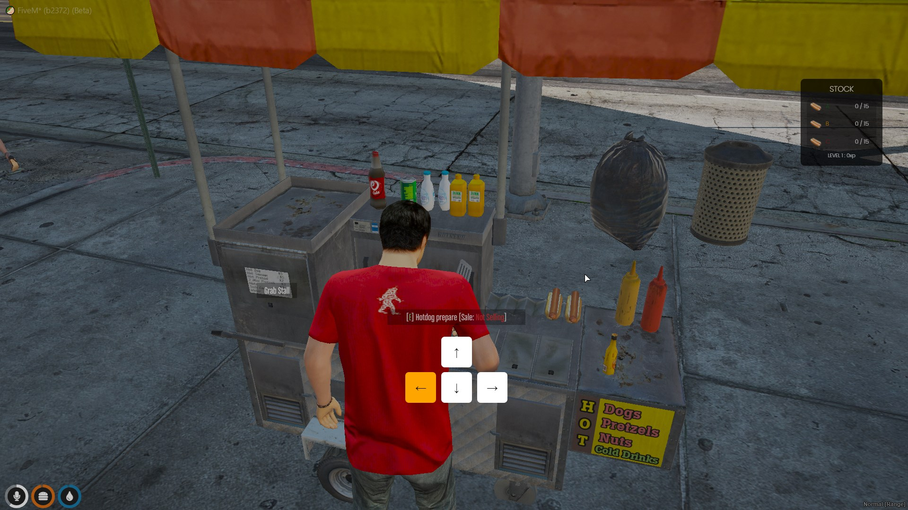

# ⌨ qb-keyminigame

## Introduction

* This is a JavaScript mini game that prompts players to press certain keys within a set amount of time and returns how many times they messed up

## Preview



## Configuration


This resource requires no configuration and has no dependencies


## Usage example

```lua
local function minigameResults(faults) -- callback function with fault amount
    if faults == 0 then
        print('Player finished game with 0 faults!')
    elseif faults == 1 then
        print('Player finished game with 1 faults!')
    elseif faults == 2 then
        print('Player finished game with 2 faults!')
    end
end

RegisterCommand('keyminigame', function()
    TriggerEvent('qb-keyminigame:show') -- displays game UI on screen
    TriggerEvent('qb-keyminigame:start', minigameResults) -- starts game
end)
```
