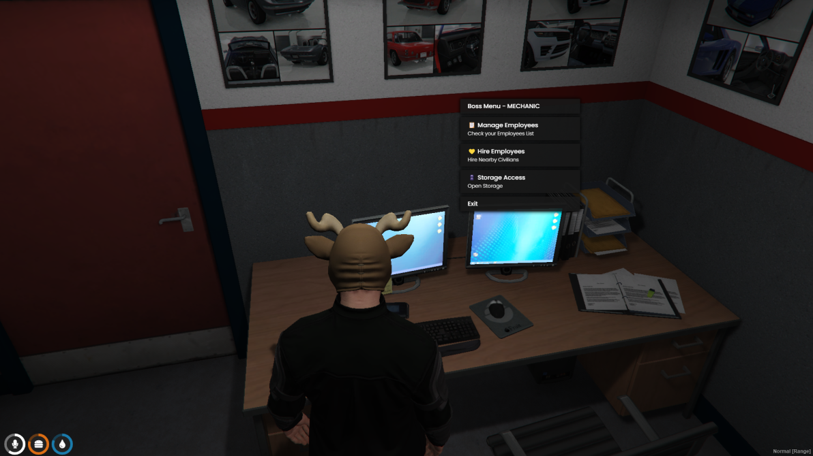

# 👔 qb-management

## Introduction

* Manage employees online or offline!
* Access a personal boss level stash!
* Allows for multiple boss menu locations!

## Preview



## Configuration


These locations are accessible to those with the `PlayerData.job.isboss` role from the qb-core/shared/jobs.lua file!


#### Job Boss Menu

```lua
Config.BossMenus = {
    police = {
        vector3(447.16, -974.31, 30.47),
    },
    ambulance = {
        vector3(311.21, -599.36, 43.29),
    },
    cardealer = {
        vector3(-32.94, -1114.64, 26.42),
    },
    mechanic = {
        vector3(-347.59, -133.35, 39.01),
    },
}
```

#### Gang Boss Menu

```lua
Config.GangMenus = {
    lostmc = {
        vector3(0, 0, 0),
    },
    ballas = {
        vector3(0, 0, 0),
    },
    vagos = {
        vector3(0, 0, 0),
    },
    cartel = {
        vector3(0, 0, 0),
    },
    families = {
        vector3(0, 0, 0),
    },
}
```
