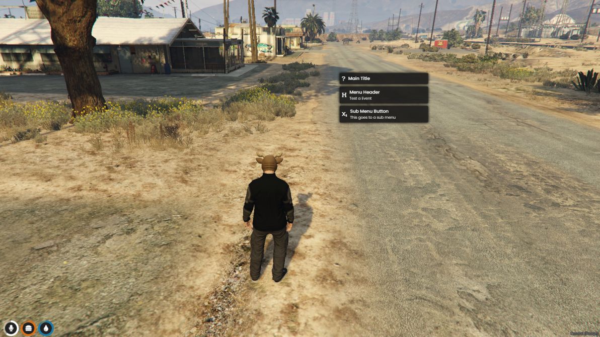
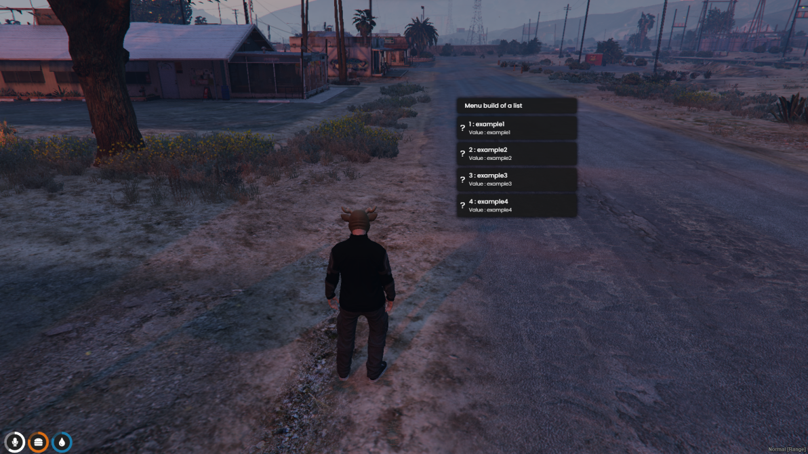

# ↖ qb-menu

## Introduction

* An NUI menu with pressable buttons is very easy to use/edit and very versatile


Menu icons can be found on the [Font Awesome](https://fontawesome.com/) website


## Preview





## Usage Example

### Static menu


Examples are done on the CLIENT side


```etlua
RegisterCommand('qbmenutest', function()
    exports['qb-menu']:openMenu({
        {
            header = 'QBCore Test Menu',
            icon = 'fas fa-code',
            isMenuHeader = true, -- Set to true to make a nonclickable title
        },
        {
            header = 'First Button',
            txt = 'Print a message!',
            icon = 'fas fa-code-merge',
            params = {
                event = 'qb-menu:client:testButton',
                args = {
		    message = 'This was called by clicking a button'
                }
            }
        },  
        {
            header = 'Second Button',
            txt = 'Open a secondary menu!',
            icon = 'fas fa-code-pull-request',
            -- disabled = false, -- optional, non-clickable and grey scale
            -- hidden = true, -- optional, hides the button completely
            params = {
                -- isServer = false, -- optional, specify event type
                event = 'qb-menu:client:subMenu',
                args = {
                    number = 2,
                }
            }
        },
    })
end)

RegisterNetEvent('qb-menu:client:subMenu', function(data)
    local number = data.number
    exports['qb-menu']:openMenu({
        {
            header = 'Return to main menu',
            icon = 'fa-solid fa-backward',
            params = {
                event = 'qb-menu:client:mainMenu',
                args = {}
            }
        },
        {
            header = 'Sub-menu button',
            txt = 'Print a message!',
            icon = 'fas fa-code-merge',
            params = {
                event = 'qb-menu:client:testButton',
                args = {
		    message = 'This was called by clicking a button'
                }
            }
        }
    })
end)

RegisterNetEvent('qb-menu:client:mainMenu', function()
    ExecuteCommand('qbmenutest')
end)

RegisterNetEvent('qb-menu:client:testButton', function(data)
    print(data.message)
end)
```

### For loop menu

```etlua
local staff = { -- our table we will loop through to get button values
    ['Kakarot'] = 'Dictator',
    ['Kings'] = 'Pleb',
    ['Griefa'] = 'Toxic',
    ['Fish'] = 'Sexy'
}

RegisterCommand('qbmenutable', function()
    local staffList = {}
    staffList[#staffList + 1] = { -- create non-clickable header button
        isMenuHeader = true,
        header = 'QBCore Test Loop Menu',
        icon = 'fa-solid fa-infinity'
    }
    for k,v in pairs(staff) do -- loop through our table
        staffList[#staffList + 1] = { -- insert data from our loop into the menu
            header = k,
            txt = 'Yeah they are definitely '..v,
            icon = 'fa-solid fa-face-grin-tears',
            params = {
                event = 'example:client:notify', -- event name
                args = {
                    name = k, -- value we want to pass
                    label = v
                }
            }
        }
    end
    exports['qb-menu']:openMenu(staffList) -- open our menu
end)

RegisterNetEvent('example:client:notify', function(data)
    print('My favorite QBCore staff member is the '..data.label..' '..data.name)
end)
```
