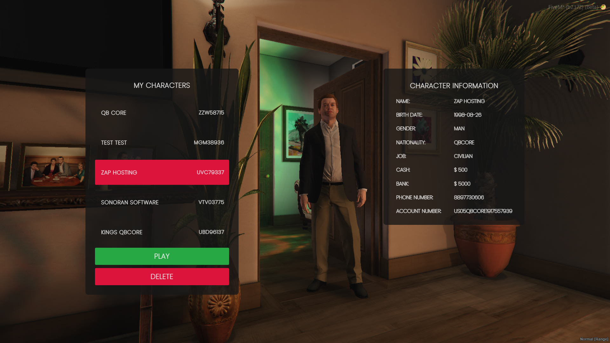

# 🙋 qb-multicharacter

## Introduction

* Allows your players to create a character by entering their name, date of birth, etc.

## Preview



## Configuration

### General

```lua
Config = {}

-- Define if the player can delete their characters or not
Config.EnableDeleteButton = true

-- Interior to load where characters are previewed
Config.Interior = vector3(-814.89, 181.95, 76.85)

-- Default spawn coords if you have start apartments disa
Config.DefaultSpawn = vector3(-1035.71, -2731.87, 12.86)

-- Create preview ped at these coordinates
Config.PedCoords = vector4(-813.97, 176.22, 76.74, -7.5)

-- Hides your actual ped while you are in selection
Config.HiddenCoords = vector4(-812.23, 182.54, 76.74, 156.5)

-- Camera coordinates for character preview screen
Config.CamCoords = vector4(-813.46, 178.95, 76.85, 174.5)
```

### Apartments integration


If you disable start apartments, make sure you select a suitable default spawn location!


```lua
Config.StartingApartment = true -- enable/disable starting apartments

-- Default spawn coords if you have the above false
Config.DefaultSpawn = vector3(-1035.71, -2731.87, 12.86)
```

### Character slots

```lua
-- Define maximum amount of default characters
Config.DefaultNumberOfCharacters = 5

-- Define maximum amount of player characters by identifier
Config.PlayersNumberOfCharacters = {
    {
        license = "license:xxxxxxxxx", -- players rockstar license
        numberOfChars = 2 -- number of slots
    },
}
```
