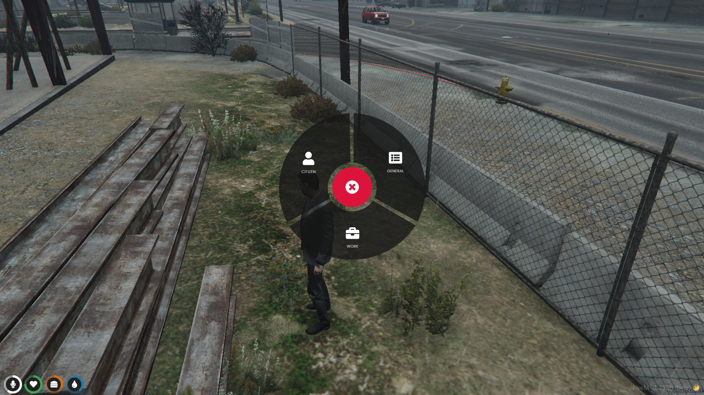

# 🔄 qb-radialmenu

## Introduction

* Similar to [qb-menu.md](qb-menu.md "mention") , this NUI menu allows for multiple actions to be done and is configurable based on job


This menu can be heavily modified to change its behavior based on a number of different scenarios such as where the player is located and more!



Supports up to [Font Awesome](https://fontawesome.com/) version 6.1.1


## Preview



## Configuration

### General

```lua
Config = {}
Config.EnableExtraMenu = true -- enable/disable vehicle extra's menu
Config.ExtrasEnabled = true -- enable/disable the extra clothing commands
```


Read USAGE EXAMPLE BELOW before attempting to use this menu!!


### Usage example


When looking at the config it can be intimidating but read this format and it will help!


```lua
Config.MenuItems = { -- this is the main table for the menu and is not job locked
    [1] = { -- index of the menu option, this must be in order numerically
        id = 'mainmenu', -- id of the menu option, this must be unique!
        title = 'Main Menu Option', -- title shown on the menu option
        icon = 'bars', -- icon shown on the menu option
        items = { -- anything in the items table is considered a sub menu!
            {
                id = 'submenu',
                title = 'Sub Menu Option',
                icon = 'bars',
                type = '', -- event type to call, client/server
                event = '', -- event name to call
                shouldClose = true -- enable/disable menu closing on click
            },
            { -- example of adding another sub menu item
                id = 'submenu2',
                title = 'Another Sub Menu',
                icon = 'bar',
                items = { -- example of adding a sub menu inside a sub menu
                    {
                        id = 'nestedsubmenu',
                        title = 'Nested Sub Menu Option',
                        icon = 'bars',
                        type = '', -- event type to call, client/server/command/qbcommand
                        event = '', -- event name, command name
                        shouldClose = true -- enable/disable menu closing on click
                    }
                }
            },
        }
    },
    [2] = { -- example of adding another main menu item
        id = 'mainmenu2',
        title = 'Another main menu item',
        icon = 'bars',
        items = {
            {
                id = 'submenu3',
                title = 'Sub Menu',
                icon = 'bars',
                type = '',
                event = '',
                shouldClose = true
            },
        }
    }
}
```

### Job menu

```lua
Config.JobInteractions = {
    ["taxi"] = { -- menu index is the job name, must match!
        {
            id = 'togglemeter',
            title = 'Show/Hide Meter',
            icon = 'eye-slash',
            type = 'client',
            event = 'qb-taxi:client:toggleMeter',
            shouldClose = false
        }, {
            id = 'togglemouse',
            title = 'Start/Stop Meter',
            icon = 'hourglass-start',
            type = 'client',
            event = 'qb-taxi:client:enableMeter',
            shouldClose = true
        }, {
            id = 'npc_mission',
            title = 'NPC Mission',
            icon = 'taxi',
            type = 'client',
            event = 'qb-taxi:client:DoTaxiNpc',
            shouldClose = true
        }
    }
}
```

### Vehicle trunks

```lua
Config.TrunkClasses = { -- vehicle class, enable/disable trunk access, rotation
    [0] = {allowed = true, x = 0.0, y = -1.5, z = 0.0}, -- Coupes
    [1] = {allowed = true, x = 0.0, y = -2.0, z = 0.0}, -- Sedans
    [2] = {allowed = true, x = 0.0, y = -1.0, z = 0.25}, -- SUVs
    [3] = {allowed = true, x = 0.0, y = -1.5, z = 0.0}, -- Coupes
    [4] = {allowed = true, x = 0.0, y = -2.0, z = 0.0}, -- Muscle
    [5] = {allowed = true, x = 0.0, y = -2.0, z = 0.0}, -- Sports Classics
    [6] = {allowed = true, x = 0.0, y = -2.0, z = 0.0}, -- Sports
    [7] = {allowed = true, x = 0.0, y = -2.0, z = 0.0}, -- Super
    [8] = {allowed = false, x = 0.0, y = -1.0, z = 0.25}, -- Motorcycles
    [9] = {allowed = true, x = 0.0, y = -1.0, z = 0.25}, -- Off-road
    [10] = {allowed = true, x = 0.0, y = -1.0, z = 0.25}, -- Industrial
    [11] = {allowed = true, x = 0.0, y = -1.0, z = 0.25}, -- Utility
    [12] = {allowed = true, x = 0.0, y = -1.0, z = 0.25}, -- Vans
    [13] = {allowed = true, x = 0.0, y = -1.0, z = 0.25}, -- Cycles
    [14] = {allowed = true, x = 0.0, y = -1.0, z = 0.25}, -- Boats
    [15] = {allowed = true, x = 0.0, y = -1.0, z = 0.25}, -- Helicopters
    [16] = {allowed = true, x = 0.0, y = -1.0, z = 0.25}, -- Planes
    [17] = {allowed = true, x = 0.0, y = -1.0, z = 0.25}, -- Service
    [18] = {allowed = true, x = 0.0, y = -1.0, z = 0.25}, -- Emergency
    [19] = {allowed = true, x = 0.0, y = -1.0, z = 0.25}, -- Military
    [20] = {allowed = true, x = 0.0, y = -1.0, z = 0.25}, -- Commercial
    [21] = {allowed = true, x = 0.0, y = -1.0, z = 0.25} -- Trains
}
```

### Vehicle seats

```lua
Config.VehicleSeats = {
    id = 'vehicleseats',
    title = 'Vehicle Seats',
    icon = 'chair',
    items = {} -- dynamically changed depending on vehicle, don't edit
}
```

### Vehicle extras

```lua
Config.VehicleExtras = {
    id = 'vehicleextras',
    title = 'Vehicle Extras',
    icon = 'plus',
    items = {
        {
            id = 'extra1',
            title = 'Extra 1',
            icon = 'box-open',
            type = 'client',
            event = 'qb-radialmenu:client:setExtra',
            shouldClose = false
        }, {
            id = 'extra2',
            title = 'Extra 2',
            icon = 'box-open',
            type = 'client',
            event = 'qb-radialmenu:client:setExtra',
            shouldClose = false
        }, {
            id = 'extra3',
            title = 'Extra 3',
            icon = 'box-open',
            type = 'client',
            event = 'qb-radialmenu:client:setExtra',
            shouldClose = false
        }, {
            id = 'extra4',
            title = 'Extra 4',
            icon = 'box-open',
            type = 'client',
            event = 'qb-radialmenu:client:setExtra',
            shouldClose = false
        }, {
            id = 'extra5',
            title = 'Extra 5',
            icon = 'box-open',
            type = 'client',
            event = 'qb-radialmenu:client:setExtra',
            shouldClose = false
        }, {
            id = 'extra6',
            title = 'Extra 6',
            icon = 'box-open',
            type = 'client',
            event = 'qb-radialmenu:client:setExtra',
            shouldClose = false
        }, {
            id = 'extra7',
            title = 'Extra 7',
            icon = 'box-open',
            type = 'client',
            event = 'qb-radialmenu:client:setExtra',
            shouldClose = false
        }, {
            id = 'extra8',
            title = 'Extra 8',
            icon = 'box-open',
            type = 'client',
            event = 'qb-radialmenu:client:setExtra',
            shouldClose = false
        }, {
            id = 'extra9',
            title = 'Extra 9',
            icon = 'box-open',
            type = 'client',
            event = 'qb-radialmenu:client:setExtra',
            shouldClose = false
        }, {
            id = 'extra10',
            title = 'Extra 10',
            icon = 'box-open',
            type = 'client',
            event = 'qb-radialmenu:client:setExtra',
            shouldClose = false
        }, {
            id = 'extra11',
            title = 'Extra 11',
            icon = 'box-open',
            type = 'client',
            event = 'qb-radialmenu:client:setExtra',
            shouldClose = false
        }, {
            id = 'extra12',
            title = 'Extra 12',
            icon = 'box-open',
            type = 'client',
            event = 'qb-radialmenu:client:setExtra',
            shouldClose = false
        }, {
            id = 'extra13',
            title = 'Extra 13',
            icon = 'box-open',
            type = 'client',
            event = 'qb-radialmenu:client:setExtra',
            shouldClose = false
        }
    }
}
```

### Vehicle doors

```lua
Config.VehicleDoors = {
    id = 'vehicledoors',
    title = 'Vehicle Doors',
    icon = 'car-side',
    items = {
        {
            id = 'door0',
            title = 'Drivers door',
            icon = 'car-side',
            type = 'client',
            event = 'qb-radialmenu:client:openDoor',
            shouldClose = false
        }, {
            id = 'door4',
            title = 'Hood',
            icon = 'car',
            type = 'client',
            event = 'qb-radialmenu:client:openDoor',
            shouldClose = false
        }, {
            id = 'door1',
            title = 'Passengers door',
            icon = 'car-side',
            type = 'client',
            event = 'qb-radialmenu:client:openDoor',
            shouldClose = false
        }, {
            id = 'door3',
            title = 'Right rear',
            icon = 'car-side',
            type = 'client',
            event = 'qb-radialmenu:client:openDoor',
            shouldClose = false
        }, {
            id = 'door5',
            title = 'Trunk',
            icon = 'car',
            type = 'client',
            event = 'qb-radialmenu:client:openDoor',
            shouldClose = false
        }, {
            id = 'door2',
            title = 'Left rear',
            icon = 'car-side',
            type = 'client',
            event = 'qb-radialmenu:client:openDoor',
            shouldClose = false
        }
    }
}
```

### Clothing commands


You should not have to touch any of this other than the menu labels to translate


```lua
Config.Commands = {
    ["top"] = {
        Func = function() ToggleClothing("Top") end,
        Sprite = "top",
        Desc = "Take your shirt off/on",
        Button = 1,
        Name = "Torso"
    },
    ["gloves"] = {
        Func = function() ToggleClothing("gloves") end,
        Sprite = "gloves",
        Desc = "Take your gloves off/on",
        Button = 2,
        Name = "Gloves"
    },
    ["visor"] = {
        Func = function() ToggleProps("visor") end,
        Sprite = "visor",
        Desc = "Toggle hat variation",
        Button = 3,
        Name = "Visor"
    },
    ["bag"] = {
        Func = function() ToggleClothing("Bag") end,
        Sprite = "bag",
        Desc = "Opens or closes your bag",
        Button = 8,
        Name = "Bag"
    },
    ["shoes"] = {
        Func = function() ToggleClothing("Shoes") end,
        Sprite = "shoes",
        Desc = "Take your shoes off/on",
        Button = 5,
        Name = "Shoes"
    },
    ["vest"] = {
        Func = function() ToggleClothing("Vest") end,
        Sprite = "vest",
        Desc = "Take your vest off/on",
        Button = 14,
        Name = "Vest"
    },
    ["hair"] = {
        Func = function() ToggleClothing("hair") end,
        Sprite = "hair",
        Desc = "Put your hair up/down/in a bun/ponytail.",
        Button = 7,
        Name = "Hair"
    },
    ["hat"] = {
        Func = function() ToggleProps("Hat") end,
        Sprite = "hat",
        Desc = "Take your hat off/on",
        Button = 4,
        Name = "Hat"
    },
    ["glasses"] = {
        Func = function() ToggleProps("Glasses") end,
        Sprite = "glasses",
        Desc = "Take your glasses off/on",
        Button = 9,
        Name = "Glasses"
    },
    ["ear"] = {
        Func = function() ToggleProps("Ear") end,
        Sprite = "ear",
        Desc = "Take your ear accessory off/on",
        Button = 10,
        Name = "Ear"
    },
    ["neck"] = {
        Func = function() ToggleClothing("Neck") end,
        Sprite = "neck",
        Desc = "Take your neck accessory off/on",
        Button = 11,
        Name = "Neck"
    },
    ["watch"] = {
        Func = function() ToggleProps("Watch") end,
        Sprite = "watch",
        Desc = "Take your watch off/on",
        Button = 12,
        Name = "Watch",
        Rotation = 5.0
    },
    ["bracelet"] = {
        Func = function() ToggleProps("Bracelet") end,
        Sprite = "bracelet",
        Desc = "Take your bracelet off/on",
        Button = 13,
        Name = "Bracelet"
    },
    ["mask"] = {
        Func = function() ToggleClothing("Mask") end,
        Sprite = "mask",
        Desc = "Take your mask off/on",
        Button = 6,
        Name = "Mask"
    }
}

local bags = {[40] = true, [41] = true, [44] = true, [45] = true}

Config.ExtraCommands = {
    ["pants"] = {
        Func = function() ToggleClothing("Pants", true) end,
        Sprite = "pants",
        Desc = "Take your pants off/on",
        Name = "Pants",
        OffsetX = -0.04,
        OffsetY = 0.0
    },
    ["shirt"] = {
        Func = function() ToggleClothing("Shirt", true) end,
        Sprite = "shirt",
        Desc = "Take your shirt off/on",
        Name = "shirt",
        OffsetX = 0.04,
        OffsetY = 0.0
    },
    ["reset"] = {
        Func = function()
            if not ResetClothing(true) then
                Notify('Nothing To Reset', 'error')
            end
        end,
        Sprite = "reset",
        Desc = "Revert everything back to normal",
        Name = "reset",
        OffsetX = 0.12,
        OffsetY = 0.2,
        Rotate = true
    },
    ["bagoff"] = {
        Func = function() ToggleClothing("Bagoff", true) end,
        Sprite = "bagoff",
        SpriteFunc = function()
            local Bag = GetPedDrawableVariation(PlayerPedId(), 5)
            local BagOff = LastEquipped["Bagoff"]
            if LastEquipped["Bagoff"] then
                if bags[BagOff.Drawable] then
                    return "bagoff"
                else
                    return "paraoff"
                end
            end
            if Bag ~= 0 then
                if bags[Bag] then
                    return "bagoff"
                else
                    return "paraoff"
                end
            else
                return false
            end
        end,
        Desc = "Take your bag off/on",
        Name = "bagoff",
        OffsetX = -0.12,
        OffsetY = 0.2
    }
}
```
