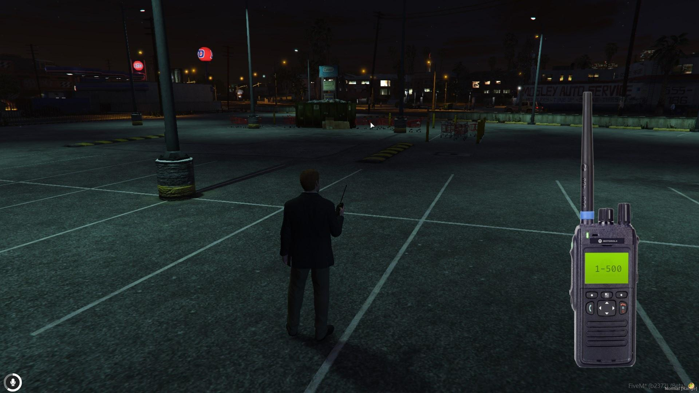

# 📻 qb-radio

## Introduction

* In addition to [qb-phone.md](qb-phone.md "mention") there is also the radio resource which provides another form of communication between players


The phone and radio both work off the [PMA](https://github.com/AvarianKnight/pma-voice) voice system


## Preview



## Configuration

### General

```lua
Config = {}
Config.MaxFrequency = 500 -- highest channel frequency allowed
```

### Restricted channels

```lua
Config.RestrictedChannels = { -- Restrict channel frequencies to specific jobs
    [1] = {
        police = true, -- job name
        ambulance = true
    },
    [2] = {
        police = true,
        ambulance = true
    },
    [3] = {
        police = true,
        ambulance = true
    },
    [4] = {
        police = true,
        ambulance = true
    },
    [5] = {
        police = true,
        ambulance = true
    },
    [6] = {
        police = true,
        ambulance = true
    },
    [7] = {
        police = true,
        ambulance = true
    },
    [8] = {
        police = true,
        ambulance = true
    },
    [9] = {
        police = true,
        ambulance = true
    },
    [10] = {
        police = true,
        ambulance = true
    }
}
```

### Translations


This will be updated to use the qbcore locale system


```lua
Config.messages = {
    ["not_on_radio"] = "You're not connected to a signal",
    ["on_radio"] = "You're already connected to this signal",
    ["joined_to_radio"] = "You're connected to: ",
    ["restricted_channel_error"] = "You can not connect to this signal!",
    ["invalid_radio"] = "This frequency is not available.",
    ["you_on_radio"] = "You're already connected to this channel",
    ["you_leave"] = "You left the channel.",
    ['volume_radio'] = 'New volume ',
    ['decrease_radio_volume'] = 'The radio is already set to maximum volume',
    ['increase_radio_volume'] = 'The radio is already set to the lowest volume',
    ['increase_decrease_radio_channel'] = 'New channel ',
}
```
