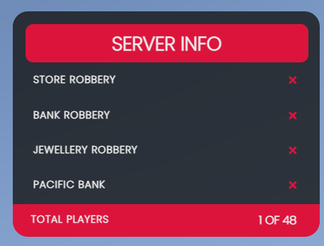

# 📋 qb-scoreboard

## Introduction

* Simple scoreboard resource that shows the total players online and the availability of robberies according to the configuration of total police needed


Make sure to edit the total police required in this resource if you change it in one of the robbery scripts otherwise, they won't match!


## Preview



## Configuration

```lua
Config = {}
Config.OpenKey = 'HOME' -- open scoreboard key
Config.ShowIDforALL = false -- enable any player to see player id's above head
Config.Toggle = true -- enable/disable toggle mode (hold key or press to show)
Config.MaxPlayers = GetConvarInt('sv_maxclients', 48) -- max server players
Config.IllegalActions = {
    ["storerobbery"] = { -- index is the robbery name
        minimumPolice = 2, -- minimum police needed for the indexed robbery
        busy = false, -- dynamically changes, don't edit
        label = "Store Robbery", -- label shown on the scoreboard UI
    },
    ["bankrobbery"] = {
        minimumPolice = 3,
        busy = false,
        label = "Bank Robbery"
    },
    ["jewellery"] = {
        minimumPolice = 3,
        busy = false,
        label = "Jewellery"
    },
    ["pacific"] = {
        minimumPolice = 5,
        busy = false,
        label = "Pacific Bank"
    },
    ["paleto"] = {
        minimumPolice = 4,
        busy = false,
        label = "Paleto Bay Bank"
    }
}
```
