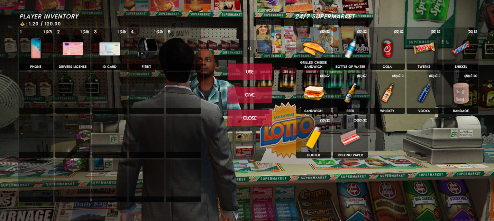

# 🏪 qb-shops

## Introduction

* Works in conjunction with [qb-inventory.md](qb-inventory.md "mention") to let players buy items


Fun fact, [qb-truckerjob.md](qb-truckerjob.md "mention") is used to refill the store stock!


## Preview



## Configuration

### Locations

```lua
Config.Locations = {
    ["247supermarket"] = { -- index must be unique!
        ["label"] = "24/7 Supermarket", -- map blip label
        ["coords"] = vector4(24.47, -1346.62, 29.5, 271.66), -- shop location
        ["ped"] = 'mp_m_shopkeep_01', -- if using target, spawns ped defined here
        ["scenario"] = "WORLD_HUMAN_STAND_MOBILE", -- applies scenario to ped
        ["radius"] = 1.5, -- radius around location to trigger draw text
        ["targetIcon"] = "fas fa-shopping-basket", -- change the qb-target icon
        ["targetLabel"] = "Open Shop", -- change the qb-target label
        ["products"] = Config.Products["normal"], -- products type, see below
        ["showblip"] = true, -- enable/disable map blip
        ["blipsprite"] = 52, -- https://docs.fivem.net/docs/game-references/blips
        ["blipcolor"] = 0 -- change the map blip color
    }
}
```

### Products


Make sure the index of the products table matches the index in the shop locations table otherwise it won't show up in the shop!


```lua
Config.Products = {
    ["normal"] = { -- product type to specify which shop it's shown in
        [1] = {
            name = "tosti", -- item name
            price = 2, -- item price
            amount = 50, -- item stock amount
            info = {}, -- item info
            type = "item", -- item type
            slot = 1, -- inventory slot to be shown in
            requiredJob = { "mechanic", "police" } -- lock this shop to job/s
            requiresLicense = true -- require weapon license to purchase
        }
    }
}
```

