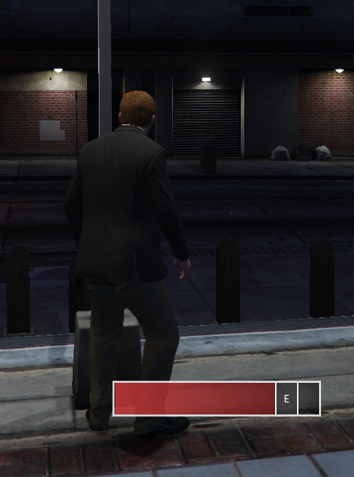

# 🤹 qb-skillbar

## Introduction

* This is a JavaScript mini game that shows a bar at the bottom of the screen with a static box and a moving box. The goal is to press E when the moving box is inside the static box!

## Preview



## Configuration


This resource requires no configuration and has no dependencies


## Usage example


Code example is done on the CLIENT side!


### Single skillbar

```lua
RegisterCommand('skillbar', function()
    local Skillbar = exports['qb-skillbar']:GetSkillbarObject()
    Skillbar.Start({
        duration = math.random(7500, 15000), -- how long the skillbar runs for
        pos = math.random(10, 30), -- how far to the right the static box is
        width = math.random(10, 20), -- how wide the static box is
    }, function()
        print('Player succeeded!')
    end, function()
        print('Player cancelled the skillbar!')
    end)
end)
```

### Multiple skillbars

```lua
local neededAttempts = 5 -- how many succesful attempts it takes to pass
local succeededAttempts = 0 -- changes dynamically do not edit

RegisterCommand('skillbarmulti', function()
    local Skillbar = exports['qb-skillbar']:GetSkillbarObject()
    Skillbar.Start({
        duration = math.random(7500, 15000), -- how long the skillbar runs for
        pos = math.random(10, 30), -- how far to the right the static box is
        width = math.random(10, 20), -- how wide the static box is
    }, function()
        if succeededAttempts + 1 >= neededAttempts then
            print('Player succeeded enough times!')
        else
            Skillbar.Repeat({
                duration = math.random(500, 1000),
                pos = math.random(10, 30),
                width = math.random(5, 12),
            })
            succeededAttempts = succeededAttempts + 1
        end
    end, function()
        print('Player cancelled the skillbar!')
    end)
end)
```
