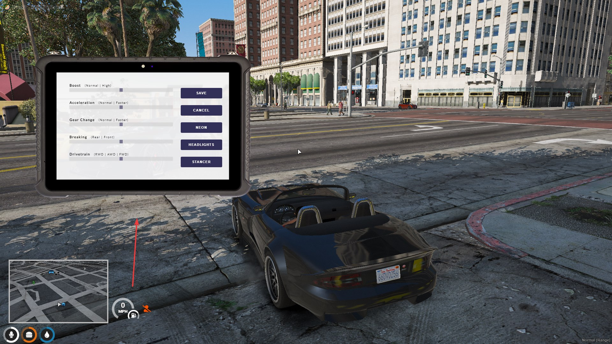

# 💻 qb-tunerchip

## Introduction

* Handles the logic for tuning your car with a in game item called "tunerlaptop"
* Handles the logic for nitrous
* Displays nitrous using [qb-hud.md](qb-hud.md "mention")


This resource has no configuration file



If you want to use wheel stancing then you must install [vstancer](https://github.com/carmineos/fivem-vstancer)


## Preview

## Items

* tunerlaptop - Use it in a vehicle to open the tuner NUI
