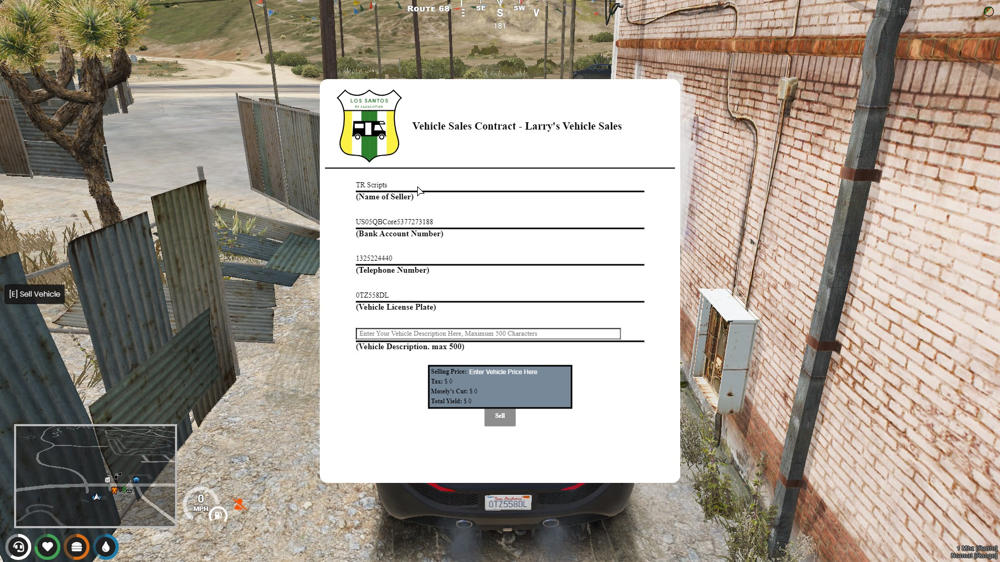

# 📄 qb-vehiclesales

## Introduction

* Players can put their car on display for others to purchase it for the price they set
* Stores occasion vehicles in the database so they stay there till sold or the seller reclaims their vehicle
* Players can sell their vehicles outright for the price of the vehicle divided by 2 found in [shared.md](../qb-core/shared.md "mention")

## Preview



## Configuration

```lua
Config = {}

Config.Zones = {
    ["SandyOccasions"] = {
        -- name shown on the UI
        BusinessName = "Vehicle Sales Contract - Larry's Vehicle Sales",
        -- interact location to place vehicle for sale
        SellVehicle = vector4(1235.61, 2733.44, 37.4, 0.42),
        -- spawn location of the bought vehicle
        BuyVehicle = vector4(1213.31, 2735.4, 38.27, 182.5),

        PolyZone = {
            vector2(1338.3748779297, 2645.0153808594),
            vector2(1098.9381103516, 2621.7487792969),
            vector2(1117.9478759766, 2822.0729980469),
            vector2(1370.98828125, 2859.197265625)
        },
        MinZ = 36.0,
        MaxZ = 64.0,

        VehicleSpots = { -- where the cars are showcased
            vector4(1237.07, 2699, 38.27, 1.5),
            vector4(1232.98, 2698.92, 38.27, 2.5),
            vector4(1228.9, 2698.78, 38.27, 3.5),
            vector4(1224.9, 2698.51, 38.27, 2.5),
            vector4(1220.93, 2698.28, 38.27, 2.5),

        }
    }
}
```
