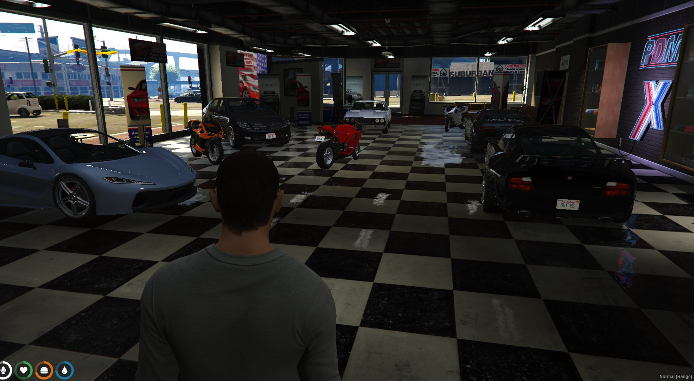

# 🚗 qb-vehicleshop

## Introduction

* Handles the logic for vehicle shops
* Uses [qb-menu.md](qb-menu.md "mention") and [qb-input.md](qb-input.md "mention") to handle the interactions with optional [qb-target.md](qb-target.md "mention") integration
* Add custom cars by adding them to your vehicles.lua in your qb-core [shared.md](../qb-core/shared.md "mention") table

**Test Drives:**

* Configurable time
* Returns player once time is up
* Can't take out more than one vehicle

**Financing:**

* Configurable down payment
* Configurable maximum payments
* Configurable commission amount for private dealerships
* Checks for payments due on player join and updates times on player logout or quit

**Shops:**

* Lock to a specific job
* Commission paid to sales person for private dealer
* Create as many as desired with easy polyzone creation
* Vehicle sale amount gets deposited into the cardealer society fund for private dealer

## Preview




## Configuration

### General

```lua
Config.Commission = 0.10 -- Percent that goes to sales person from a full car sale 10%
Config.FinanceCommission = 0.05 -- Percent that goes to sales person from a finance sale 5%
Config.FinanceZone = vector3(-29.53, -1103.67, 26.42) -- Where the finance menu is located
Config.PaymentWarning = 10 -- time in minutes that player has to make payment before repo
Config.PaymentInterval = 24 -- time in hours between payment being due
Config.MinimumDown = 10 -- minimum percentage allowed down
Config.MaximumPayments = 24 -- maximum payments allowed
```

### Setting up shops


A free-use shop can be accessed by any players whereas a managed shop can only be accessed by those with the configured job


```lua
Config.Shops = {
    ['pdm'] = {
        ['Type'] = 'free-use',  -- free-use/managed 
        ['Zone'] = {
            ['Shape'] = { -- polyzone that surrounds the shop
                vector2(-56.727394104004, -1086.2325439453),
                vector2(-60.612808227539, -1096.7795410156),
                vector2(-58.26834487915, -1100.572265625),
                vector2(-35.927803039551, -1109.0034179688),
                vector2(-34.427627563477, -1108.5111083984),
                vector2(-32.02657699585, -1101.5877685547),
                vector2(-33.342102050781, -1101.0377197266),
                vector2(-31.292987823486, -1095.3717041016)
            },
            ['minZ'] = 25.0,  -- min height of the shop zone
            ['maxZ'] = 28.0,  -- max height of the shop zone
            ['size'] = 2.75, -- size of the vehicles zones
        },
        ['Job'] = 'none', -- name of job or none
        ['ShopLabel'] = 'Premium Deluxe Motorsport', -- map blip name
        ['Location'] = vector3(-45.67, -1098.34, 26.42), -- map blip Location
        ['showBlip'] = true,  -- enable/disable map blip
        ['blipSprite'] = 326,  -- blip sprite
        ['blipColor'] = 3,  -- blip color
        ['Categories'] = { -- categories available to browse
            ['sportsclassics'] = 'Sports Classics',
            ['sedans'] = 'Sedans',
            ['coupes'] = 'Coupes',
            ['suvs'] = 'SUVs',
            ['offroad'] = 'Offroad',
            ['muscle'] = 'Muscle',
            ['compacts'] = 'Compacts',
            ['motorcycles'] = 'Motorcycles',
            ['vans'] = 'Vans',
            ['cycles'] = 'Bicycles'
        },
        ['TestDriveTimeLimit'] = 0.5, -- test drive time in minutes
        -- test drive return location
        ['ReturnLocation'] = vector3(-44.74, -1082.58, 26.68),
        -- spawn location of bought vehicle
        ['VehicleSpawn'] = vector4(-56.79, -1109.85, 26.43, 71.5),
        ['ShowroomVehicles'] = {
            [1] = { -- vehicle display location
                coords = vector4(-45.65, -1093.66, 25.44, 69.5),
                defaultVehicle = 'adder', -- Default display vehicle
                chosenVehicle = 'adder', -- dynamically changes, don't edit
            },
            [2] = {
                coords = vector4(-48.27, -1101.86, 25.44, 294.5),
                defaultVehicle = 'schafter2',
                chosenVehicle = 'schafter2',
            },
            [3] = {
                coords = vector4(-39.6, -1096.01, 25.44, 66.5),
                defaultVehicle = 'comet2',
                chosenVehicle = 'comet2',
            },
            [4] = {
                coords = vector4(-51.21, -1096.77, 25.44, 254.5),
                defaultVehicle = 'vigero',
                chosenVehicle = 'vigero',
            },
            [5] = {
                coords = vector4(-40.18, -1104.13, 25.44, 338.5),
                defaultVehicle = 't20',
                chosenVehicle = 't20',
            },
            [6] = {
                coords = vector4(-43.31, -1099.02, 25.44, 52.5),
                defaultVehicle = 'bati',
                chosenVehicle = 'bati',
            },
            [7] = {
                coords = vector4(-50.66, -1093.05, 25.44, 222.5),
                defaultVehicle = 'bati',
                chosenVehicle = 'bati',
            },
            [8] = {
                coords = vector4(-44.28, -1102.47, 25.44, 298.5),
                defaultVehicle = 'bati',
                chosenVehicle = 'bati',
            }
        },
    },
}
```

## Commands

/transferVehicle - Gift or sell your vehicle
